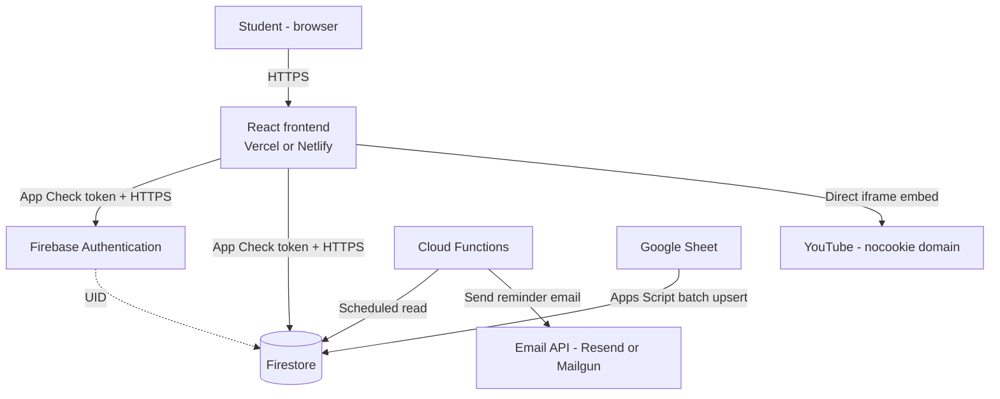
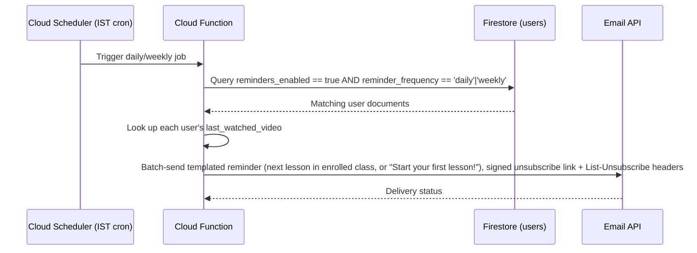
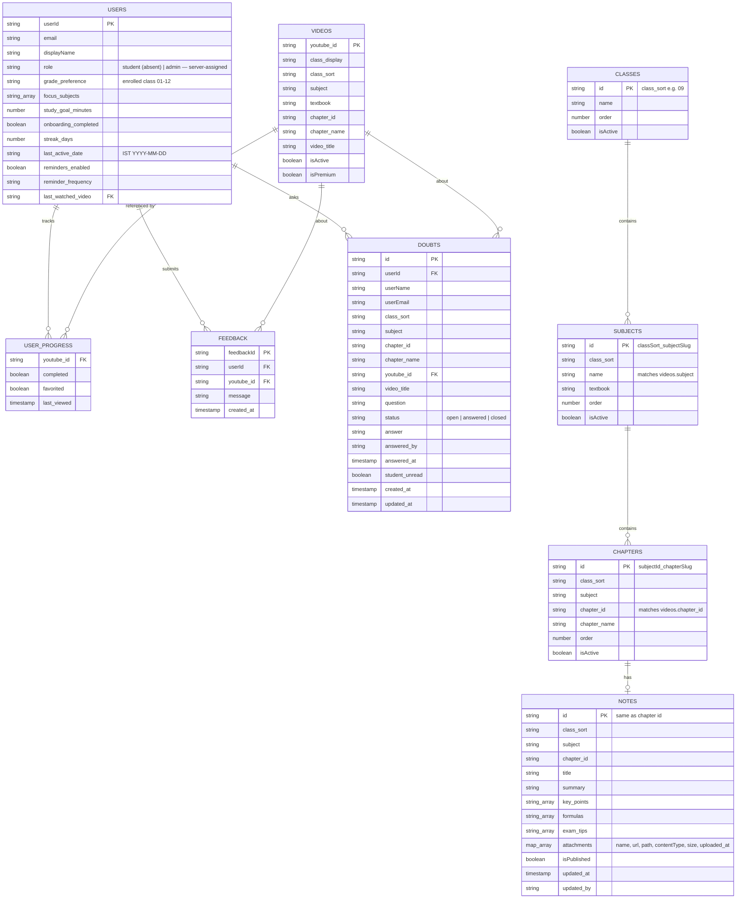

# System & Software Requirements Specification (SRS)

**Project (dummy branding):** ChapterPlay — a structured video-revision web app
**Original working title:** NCERT QuickPrep Web App
**Version:** 2.4 (adds curriculum hierarchy collections, chapter notes with Firebase Storage attachments, private doubts, and the admin dashboard)
**Date:** 17 September 2026

> **Naming note:** "ChapterPlay" and its logo in this document are placeholder branding for design and documentation purposes. Since the source content is drawn from NCERT-aligned material, avoid implying official affiliation with NCERT in real branding — confirm naming/trademark clearance before launch.

---

## 1. Introduction

### 1.1 Purpose
This SRS defines the functional and non-functional requirements, system architecture, data model, and UI/brand direction for a web application that gives students a structured, distraction-free way to browse an existing YouTube educational library, track progress, and receive revision reminders.

### 1.2 Scope (MVP)
- Single web application (responsive, not a native app).
- Account holder is assumed to be an adult using their own device/account; child-specific compliance (e.g. verified parental consent flows) is explicitly deferred to a future version.
- Video content already exists on YouTube; this app does not upload, transcode, or store video — it only stores metadata and embeds playback.
- Each student is enrolled in **one class at a time**; the student experience (dashboard, syllabus, search) is scoped to that class (Section 4.4). Visitors can explore all classes.
- A role-gated in-app Admin Console manages lessons and feedback; roles are assigned only server-side.

### 1.3 Definitions
| Term | Meaning |
|---|---|
| MAU | Monthly active users |
| App Check | Firebase service that verifies requests come from the real app, not a script/bot |
| IST | Indian Standard Time (UTC+5:30) |
| MVP | Minimum viable product |

---

## 2. Product Overview & Brand Direction

### 2.1 Concept
ChapterPlay replaces YouTube's native browsing (recommended videos, comments, unrelated clutter) with a Class → Subject → Chapter hierarchy, a persistent search bar, watch-progress tracking, favourites, and opt-in email revision reminders.

### 2.2 Color theme
A professional, education-appropriate palette — indigo for trust/focus, teal for progress/positive actions, and warm pastel tiles (reused from the same design-token family) to keep the class/subject grid visually distinct without looking childish.

| Role | Token | Hex | Usage |
|---|---|---|---|
| Primary / brand | `--color-primary` | `#3B4FE0` (Indigo) | Logo, primary buttons, links, active nav |
| Secondary / success | `--color-secondary` | `#12A594` (Teal) | Progress bars, "Continue" CTA, completed checkmarks |
| Text — primary | `--text-primary` | `#1E2233` | Headings, body text |
| Text — secondary | `--text-secondary` | `#6B7280` | Captions, helper text |
| Surface | `--surface` | `#FFFFFF` | Cards, header |
| Page background | `--bg-page` | `#F5F6FA` | App background |
| Border | `--border` | `#E3E5EC` | Hairlines, input borders |

**Class/subject tile palette** (rotates per class, same set used for subject chips so the grid stays visually organised, not random):

| Class tile | Background | Text |
|---|---|---|
| 1 | `#FAECE7` (coral 50) | `#4A1B0C` |
| 2 | `#E1F5EE` (teal 50) | `#04342C` |
| 3 | `#EEEDFE` (purple 50) | `#26215C` |
| 4 | `#FAEEDA` (amber 50) | `#412402` |
| 5 | `#FBEAF0` (pink 50) | `#4B1528` |
| 6 | `#E6F1FB` (blue 50) | `#042C53` |

Each tile pairs a light tint with the darkest shade of the *same* color family for text, so contrast stays accessible (WCAG AA) without needing black text on every tile.

### 2.3 Typography
- UI font: a single clean sans-serif (e.g. Inter or the system font stack) at 400/500 weight only — avoid heavier weights, which read as clunky on dense screens.
- Headings: 20–24px, weight 500. Body: 14–16px, weight 400. Captions: 12–13px, `--text-secondary`.

### 2.4 Logo concept
A rounded-square indigo mark containing a white play triangle (video) paired with the wordmark "Chapter" (navy) + "Play" (teal). Communicates "video" + "structured chapters" in one mark. See the logo and homepage mockup shared alongside this document for the visual reference.

---

## 3. System Architecture

### 3.1 Overview
Three-tier architecture: a static-hosted React frontend, a Firebase backend (BaaS — no custom server to manage), and a small set of external services accessed either directly by the client (YouTube) or via scheduled backend jobs (email, sheet sync).

**Why this shape:**
- **No custom backend server** — Firebase (BaaS) removes an entire tier of infrastructure to secure and patch.
- **Client never calls the YouTube Data API** — videos are embedded via stored `youtube_id` values only, so there is no API quota risk and no server-side YouTube credential to protect.
- **Two independent write paths into Firestore** — the Apps Script sync (content) and the client SDK (user data) — are kept separate by Firestore Security Rules (Section 3.3), so neither can accidentally overwrite the other's fields.

### 3.2 Tech stack

| Layer | Choice | Notes |
|---|---|---|
| Frontend framework | React (Vite or Next.js) | Static build, deployed on Vercel/Netlify |
| Styling | Tailwind CSS or CSS Modules | Implements the token table in Section 2.2 |
| Auth | Firebase Authentication | Google Sign-In, Mobile OTP, Email link |
| Database | Firestore (NoSQL, document-based) | See schema in Section 4 |
| File storage | Firebase Storage | Notes & cheat-sheet attachments (PDF/PNG/JPG/WEBP ≤ 20 MB) under `notes/{chapterKey}/` |
| Backend logic | Firebase Cloud Functions (Node.js) | Scheduled reminder jobs, rate-limited feedback writes |
| Video playback | HTML5 `<iframe>` to `youtube-nocookie.com` | No YouTube Data API calls at runtime |
| Email delivery | Resend or Mailgun (free tier) | Triggered by Cloud Functions |
| Content sync | Google Apps Script | Reads a Google Sheet, batch-upserts to Firestore |
| Analytics | Firebase Analytics | Initialised only when `VITE_FIREBASE_MEASUREMENT_ID` is set and the browser supports it; usage tracking only, no PII beyond Firebase defaults |
| Hosting | Vercel or Netlify | CDN-backed static hosting |

### 3.3 Security architecture
Security is layered rather than relying on any single control:

1. **Transport** — HTTPS everywhere (enforced by Vercel/Netlify and Firebase by default).
2. **Request authenticity — Firebase App Check** — initialised in the client with the reCAPTCHA v3 provider (`VITE_RECAPTCHA_V3_SITE_KEY`, debug token for local development) before any Firebase service is used. The `submitFeedback` and `deleteAccount` callables set `enforceAppCheck: true`; Firestore and Auth enforcement is switched on in the console once metrics confirm legitimate traffic carries tokens.
3. **Authorization — Firestore Security Rules** (declarative, enforced server-side, not just in app code):

   | Collection | Read | Write |
   |---|---|---|
   | `videos` | Public (any authenticated or anonymous read) | Admins (`role == 'admin'` or `admin` custom claim) and the Apps Script sync path only; students denied |
   | `users` | Owner or admin | Owner may create/update their own document **except the `role` field** (create must not contain `role`; update must not change it). Only admins / Admin SDK set `role`. Owner or admin may delete |
   | `user_progress` (sub-collection of `users`) | Owner or admin | Owner or admin |
   | `feedback` | Admins only (students cannot read back) | Create: denied to all clients — only the `submitFeedback` Cloud Function (Admin SDK) writes. Update/delete: admins only |
   | `rate_limits` | Denied | Denied (server-only state for the feedback and doubts limiters) |
   | `classes`, `subjects`, `chapters` | Public | Admins only |
   | `notes` | `get`: public if `isPublished == true` or the document does not exist; `list`: only queries constrained to `isPublished == true`; admins read everything | Admins only |
   | `doubts` | The asking student (`userId == auth.uid`) and admins | Create: denied to clients — only the `askDoubt` function. Update: admins; the asking student may change only `student_unread` (to false), `status` (to `closed`) and `updated_at`. Delete: admins |
   | Storage `notes/{chapterKey}/{file}` | Public via download URL | Admins only (checked with `firestore.get` on `users/{uid}.role`), size < 20 MB, content type PDF/PNG/JPEG/WEBP. All other Storage paths are denied |

   Client code must never decide admin status from anything other than `users.role` (e.g. no email-pattern checks), and the UI must not expose a role toggle — the rules above are the real boundary, the UI gating is convenience only.

4. **Rate limiting** — the `submitFeedback` callable keeps the last hour of submission timestamps in `rate_limits/feedback_{uid}` and checks/updates it in the same Firestore transaction that creates the feedback document, so concurrent requests cannot exceed 5 per hour. The client-side counter is only a UI hint.
5. **Least-privilege data sync** — the Apps Script sync writes only the columns defined in Section 4.1(A) and is explicitly forbidden from touching `isActive`, so a re-run of the sync can never silently undo an admin's manual moderation.
6. **Secrets** — Email API keys and any service-account credentials live in Firebase Functions config/Secret Manager, never in client-side code or the Git repository.
7. **Budget safety net** — a Firebase budget alert (see Section 5) flags cost anomalies early; it is a monitoring trip-wire, not a hard spending cap.

### 3.4 Data flow: automated email reminders (FR-7)

### 3.5 Search implementation approach
Firestore does not support substring or full-text search natively — only prefix matching, which is not enough for FR-5's "match anywhere in the title/chapter/subject" requirement. Two options, in order of MVP fit:

| Option | How it works | Cost | Recommendation |
|---|---|---|---|
| **Client-side search (recommended for MVP)** | The active-video index (already cached in `localStorage` per FR-4) is searched in the browser using a lightweight fuzzy-search library (e.g. Fuse.js). No server round-trip. | Free — no extra service | Use this while the catalog stays in the low thousands of videos; re-evaluate if it grows past ~10,000 entries or search latency becomes noticeable. |
| **Hosted search service** | A service like Algolia or Typesense indexes `videos` and answers search queries directly. | Algolia free tier: 10k records / 10k searches per month; paid beyond that | Adopt only if the catalog or traffic outgrows client-side search. |

This decision should be stated explicitly in any developer hand-off — "search" is not a built-in Firestore capability and needs one of the two approaches above.

### 3.6 Operational readiness

| Concern | Approach |
|---|---|
| **Backups / disaster recovery** | Enable scheduled Firestore exports (e.g. daily, to a Cloud Storage bucket) via the Firebase console or a scheduled Cloud Function, so content and user data can be restored after accidental deletion or corruption. |
| **CI/CD** | Frontend: connect the Git repository directly to Vercel/Netlify for automatic build + deploy on push to `main`, with preview deployments per pull request. Backend: deploy Cloud Functions via the Firebase CLI from a CI pipeline (e.g. GitHub Actions) rather than manually from a developer machine, so deployments are repeatable and reviewed. |
| **Monitoring & alerting** | Beyond the $1 budget alert (a cost trip-wire, not a functional check): configure Firebase Alerts (or a simple Cloud Function health-check) for Cloud Function failures, so a silently-failing reminder job doesn't go unnoticed. Firebase Analytics/Crashlytics-equivalent web error logging should also be enabled to catch client-side errors in production. |

---

## 4. Data Architecture

### 4.1 Firestore schema (entity-relationship view)

`videos.isActive` lives exclusively in Firestore and is never overwritten by the sync script — it is the admin's manual visibility toggle and must survive repeated syncs. A document with no `isActive` field is treated as active (the SRS default).

**Stored class format.** Firestore keeps the Google Sheet values: `class_display` = sheet `class` (e.g. `"Class IX"`), `class_sort` = sheet `Class Numeral` (e.g. `"Class 9"`). The client and Cloud Functions normalise both on read to a zero-padded numeral (`"09"`) for sorting, filtering and `users.grade_preference`, and display it as "Class 9". Admin Console writes convert back to the stored format.

**Lesson order.** Within a class and subject, lessons are ordered by `chapter_id` using natural number order (`CH-2` before `CH-10`). This order drives the syllabus, the player's "next lesson" and FR-7 reminder suggestions.

**`users` defaults on creation:** `reminders_enabled: true`, `reminder_frequency: 'weekly'`, `last_watched_video: null`, no `role`.

### 4.2 Data ingestion
A Google Apps Script (`scripts/google-apps-script-sync.js`) reads the sheet by header name — `class`, `Class Numeral`, `subject`, `book`, `chapter`, `Chapter Title`, `YT Vid Title`, `YT Vid ID` — and upserts into `videos` keyed on `YT Vid ID`:
- Authenticates as a service account (Cloud Datastore User) using a signed JWT; credentials live in Script Properties, never in source.
- Looks up which IDs already exist (`documents:batchGet`), then writes through `documents:commit` in batches of up to 500.
- Existing documents: `updateMask` lists only the seven sheet fields, so `isActive` and `isPremium` are never touched.
- New documents: also set `isActive: true` and `isPremium: false`.
- Rows with an empty or malformed ID (not 11 URL-safe characters) are skipped and logged; duplicate IDs keep the last row.

### 4.3 Edge case: a deactivated video already referenced in user data
If an admin sets `isActive = false` on a video that already appears in someone's `user_progress` or favourites, the reference itself is **not** deleted — only its visibility in browse/search changes. Defined behaviour:
- **Favourites list / "Jump back in":** the tile still renders (so the list doesn't silently shrink or error) but is visually marked "No longer available" and is not clickable into the player.
- **Search/browse:** the video is excluded from results and the visual grid, exactly as `isActive = false` intends.
- **Progress stats:** a previously completed video keeps counting toward completion totals even if later deactivated — the user's history shouldn't be rewritten by an admin's content change.

### 4.4 Enrolled class model
- `users.grade_preference` holds the student's single enrolled class (`"01"`–`"12"`, zero-padded to match `videos.class_sort`). It is set during onboarding (or email sign-up) and changed only from Profile & Settings.
- For a signed-in student, the dashboard, the Subject → Chapter syllabus view and the client-side search index (Section 3.5) are filtered to `videos.class_sort == grade_preference` and `isActive == true`. There is no class picker on these screens.
- Changing class does **not** delete `user_progress`; completed lessons and favourites from the earlier class remain in history, the favourites list and the profile totals. `focus_subjects` is reset on class change because subject sets differ by class.
- A student with no `grade_preference` is held in onboarding until one is chosen. Admin accounts do not require a class.
- Reminder emails (FR-7) should pick the "next chapter" from the enrolled class; if `last_watched_video` belongs to a different class, fall back to the first unfinished lesson of the enrolled class.

### 4.5 Streak and XP computation
- **Active day:** an IST calendar day on which the student opened at least one lesson. On each lesson view the client computes today's IST date: same as `last_active_date` → no change; the day after → `streak_days + 1`; otherwise → `streak_days = 1`. Both fields are written to `users` in the same update.
- **Displayed streak:** `streak_days` if `last_active_date` is today or yesterday (IST), else 0.
- **XP:** derived, not stored — `50 × completed lessons`; level = floor(XP / 100) + 1. Dashboard level uses completed lessons in the enrolled class; profile total uses all completed lessons.
- Seed/demo data must not pre-populate streak or XP values that the student did not earn.

### 4.6 Curriculum hierarchy overlay
Videos (from the Sheet sync) remain the source of lessons. `classes`, `subjects` and `chapters` are an optional admin-managed overlay:
- **Keys:** `classes/{class_sort}`, `subjects/{class_sort}_{slug(subject)}`, `chapters/{subjectId}_{slug(chapter_id)}`, where `slug` lower-cases and replaces non-alphanumerics with `-`. Notes use the chapter key as their document ID, so the same `chapter_id` in different classes or subjects never collides.
- **Merge:** the student catalogue is the union of items found in active videos and active records. A record with `isActive == false` hides that item and everything under it. Records supply display order, class display name, subject textbook and chapter name overrides. Items without records are visible and ordered by class number, subject name and natural `chapter_id` order.
- Chapters with a record but no videos are shown (with a "coming soon" note) so notes can be published first.
- Subject names and chapter IDs are immutable after creation because they are the join keys to videos, notes and doubts.

### 4.7 Notes, attachments and doubts data rules
- **Notes:** one document per chapter key. Drafts (`isPublished == false`) are admin-only. Students load a single note with `get` and the syllabus index with a query on `class_sort == X AND isPublished == true` (no composite index needed).
- **Attachments:** stored in Firebase Storage at `notes/{chapterKey}/{timestamp}_{sanitisedName}`; the note document holds the download URL and storage path. Uploading a file immediately re-saves the note; removing a file deletes the Storage object; deleting a note deletes all of its files. Demo mode stores files as data URLs in `localStorage` (≤ 1.5 MB each).
- **Doubts:** created only by `askDoubt` (App Check enforced) with lesson context read server-side from `videos`, and a rolling 24-hour limit of 10 per student kept in `rate_limits/doubts_{uid}` inside the same transaction. Students subscribe with `where userId == uid orderBy created_at desc` (composite index `userId ASC, created_at DESC`). Replying sets `status = 'answered'`, `answer`, `answered_by`, `answered_at` and `student_unread = true`.
- **Deletion:** `deleteAccount` also deletes the user's `doubts` and `rate_limits/doubts_{uid}`.

---

## 5. Non-Functional Requirements

| ID | Requirement |
|---|---|
| NFR-1 | Anti-spam & privacy: every reminder email includes an "Unsubscribe" link (HMAC-signed with `UNSUBSCRIBE_SECRET`, served by the `unsubscribe` function for GET and RFC 8058 POST) that sets `reminders_enabled = false`; app includes a Privacy Policy page and self-service account deletion via the `deleteAccount` callable (recursive delete of `users` + `user_progress`, rate-limit state, then the Auth record), which requires a sign-in within the last 5 minutes. |
| NFR-2 | Marketing/landing copy stays audience-neutral (no child-directed language, per MVP scope). |
| NFR-3 | Firebase App Check on all endpoints; rate limiter on `feedback` writes, quantified at **max 5 submissions per user per hour** (configurable), returning a clear "try again later" response beyond that. |
| NFR-4 | Responsive layout via flexbox/grid, desktop to mobile. |
| NFR-5 | Firestore Security Rules as in Section 3.3, with composite indexes pre-defined for the `reminders_enabled` + `reminder_frequency` query used in FR-7. |
| NFR-6 | SPF, DKIM and DMARC configured and verified on the sending domain before go-live, to protect email deliverability. |
| NFR-7 | Firebase Blaze plan with a budget alert configured (Section 3.3.7) before any scheduled function is deployed. |
| NFR-8 | **Performance:** first meaningful paint of the homepage under 2.5s on a throttled "Fast 3G" connection; video player mounts within 1s of tap on a broadband connection; search suggestions return within 500ms (Section 3.5). |
| NFR-9 | **Scalability target (MVP):** architecture supports up to ~5,000 MAU without redesign, within Firestore's standard read/write limits and the client-side search approach in Section 3.5. |
| NFR-10 | **Accessibility:** interface meets WCAG 2.1 AA where practical — keyboard-navigable menus and player controls, visible focus states, alt text on icons/images, and color contrast ratios of at least 4.5:1 for body text (the palette in Section 2.2 is chosen to satisfy this). |
| NFR-11 | **Data protection (India DPDP Act, 2023):** Privacy Policy states what personal data is collected (email, watch history) and why; users can access and delete their data (already covered by NFR-1); a grievance/contact channel is published for data requests; data is retained only as long as the account is active plus a defined deletion grace period. *(This is a placeholder scope note, not legal advice — have the final policy reviewed by counsel before launch.)* |
| NFR-12 | **Operational readiness:** scheduled Firestore backups, CI/CD for both frontend and Cloud Functions, and failure alerting on scheduled jobs, as detailed in Section 3.6. |
| NFR-13 | **Content storage limits:** note attachments limited to PDF/PNG/JPEG/WEBP under 20 MB each, enforced in both the admin UI and Storage rules; doubts limited to 10–2,000 characters and 10 per student per 24 hours, enforced server-side. |

---

## 6. Assumptions & Constraints
- Video content and rights already exist on YouTube; this app only stores and displays metadata.
- The client never calls the YouTube Data API at runtime — only stored `youtube_id` values are used for embeds.
- Child-specific regulatory compliance is out of scope for this MVP (adult account holder assumed).
- Final branding (name, logo, and color theme) shown here is a placeholder for internal review — see the naming note at the top of this document.
