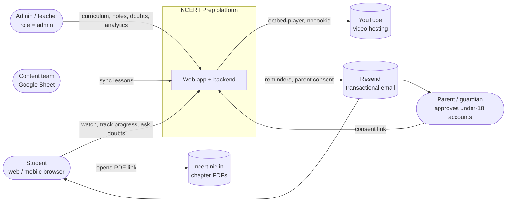
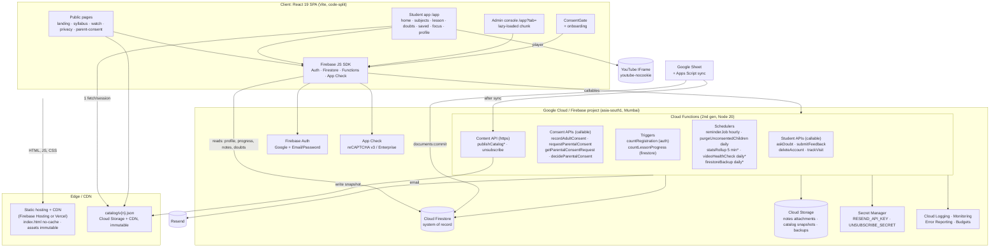
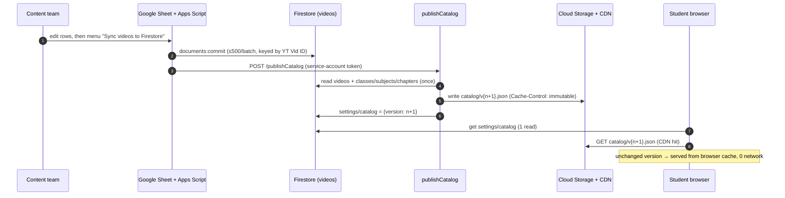
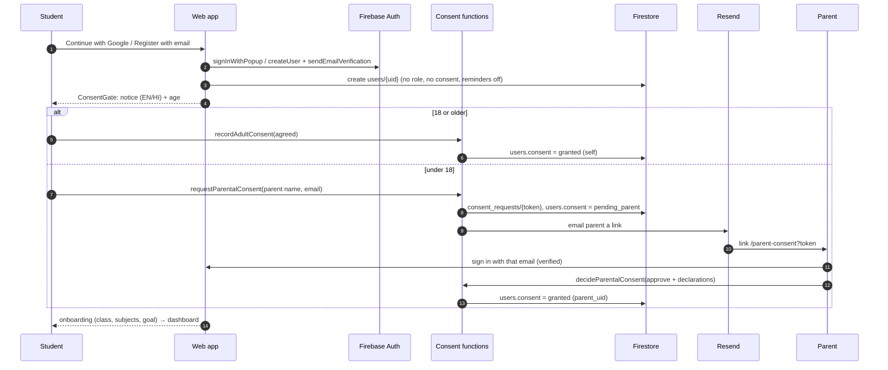
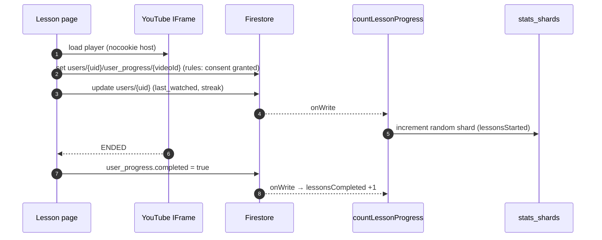
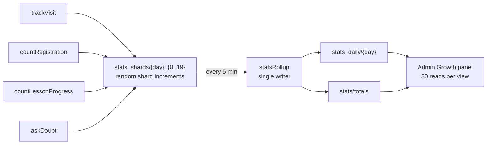
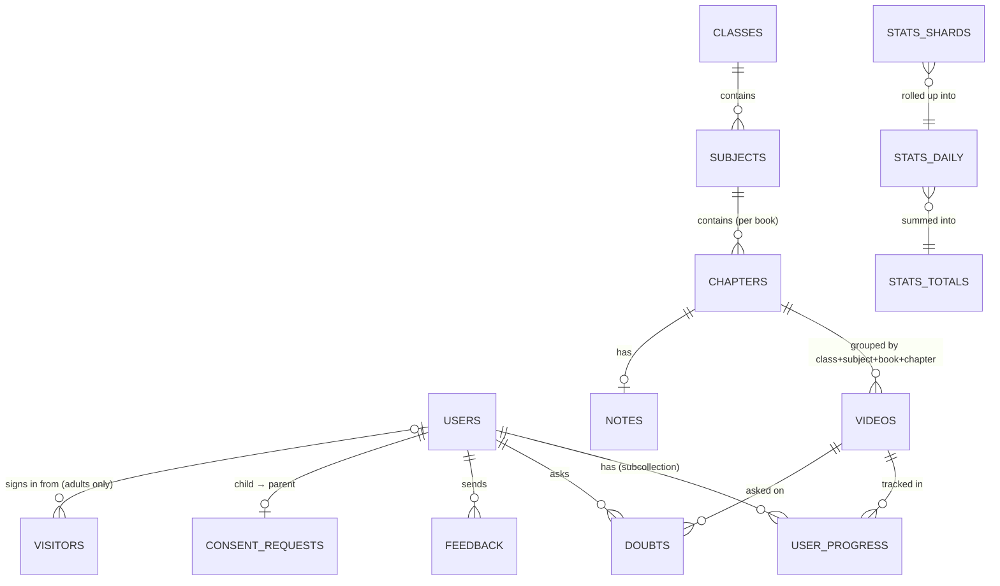
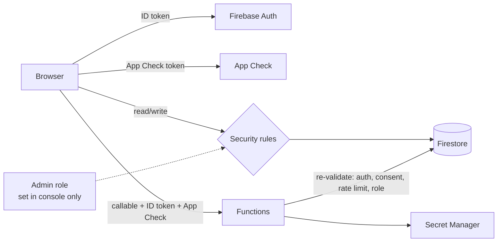
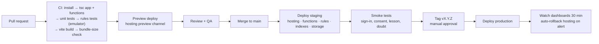
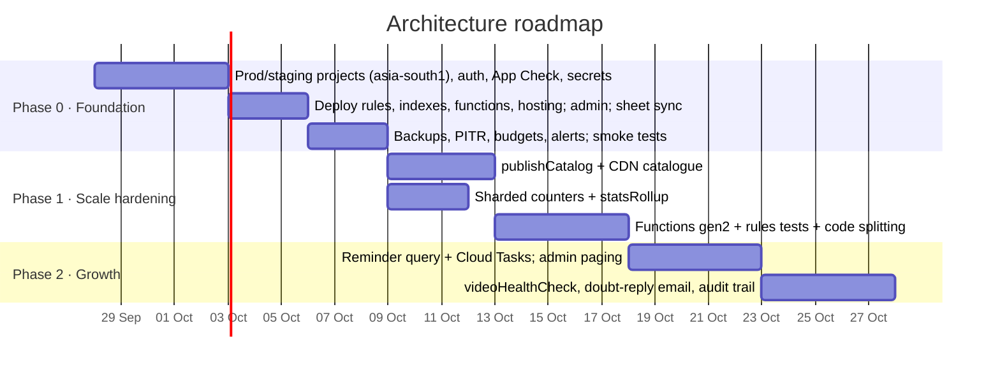

# NCERT Prep — System Architecture

| | |
|---|---|
| **Scope** | Target architecture, services, data schema, scaling plan, security, operations and deployment |
| **Based on** | The codebase as of 22 September 2026 (React SPA + Firebase + Google Sheet content pipeline) |
| **Companion docs** | `docs/PROJECT_SPECIFICATION.md` (code analysis, FRD, SRS; C10 = sheet contract) |
| **Design target** | 100,000 registered students, 20,000 daily actives, exam-season evening peaks, with headroom to 1M |

> **Bottom line:** stay serverless on Firebase. Nothing in this product needs a custom server or SQL database at 100k students. YouTube serves the video bandwidth, which is the expensive part. Eight changes (§7), most of them small, take the current code from "fine for a pilot" to "fine for 100k". The two that matter most:
> 1. Stop reading the whole catalogue from Firestore on every page load.
> 2. Shard the analytics counters.

---

## Contents

1. Goals and load model
2. System context
3. Target architecture (block diagram)
4. Services catalogue
5. Key flows
6. Data architecture and schema
7. Scaling analysis: bottlenecks and fixes
8. Security and privacy architecture
9. Reliability, backups and observability
10. Environments and CI/CD
11. Deployment plan
12. Cost model
13. Roadmap
14. Architecture decisions

---

## 1. Goals and load model

### 1.1 Quality goals

| Goal | Target |
|---|---|
| Availability | 99.9% monthly for student paths (sign-in, dashboard, lesson, progress) |
| Latency (India, 4G) | First meaningful paint ≤ 2.5 s; lesson page ≤ 1.5 s after the shell is cached; callable functions p95 ≤ 800 ms |
| Scale | 100k registered, 20k DAU, 3k concurrent at peak; no redesign needed up to 1M registered |
| Cost | Grows with *active* users, not with page views; about ₹0 when idle |
| Privacy | DPDP Act 2023 by design: consent before processing, parental consent for under-18s, no tracking of children |
| Operability | One engineer can run it: managed services, alerts, backups, one-command deploys |

### 1.2 Load model (design point)

| Quantity | Assumption | Value |
|---|---|---|
| Registered students | design point | 100,000 |
| Daily active students | 20% of registered | 20,000 |
| Daily visitors (incl. anonymous) | 1.5× DAU | 30,000 |
| Peak window | 18:00–22:00 IST carries 40% of the day | 12,000 sessions in 4 h |
| Peak arrival rate | 3× the peak-window average | about 2.5 new sessions/s |
| Concurrent users at peak | about 15 min per session | about 3,000 |
| Lessons opened per session | | 3 |
| Firestore writes per lesson | progress doc + user doc (streak, last watched) | 2–3 |
| Peak write rate (whole database) | 2.5 sessions/s × 3 lessons × 3 writes | **about 25 writes/s**. Firestore handles 10,000+/s, so this is a non-issue *except for hot documents* (§7.2) |
| Video egress | served by YouTube | **0 bytes from us** |

---

## 2. System context

---

## 3. Target architecture (block diagram)

\* = proposed service (§4.2). Everything else exists in the codebase today.

**Principles**

1. **Firestore is the system of record; the CDN is the read path for shared content.** Data every visitor needs (the catalogue) is published once as a versioned JSON file and cached at the edge. Per-user data (profile, progress, doubts) is read from Firestore.
2. **Browsers write only their own data.** That means profile fields and lesson progress (after consent). Anything that needs trust, rate limiting or cross-user effects goes through a Cloud Function: consent, doubts, feedback, counters, deletion, email.
3. **Every privileged action is enforced twice.** Security rules check it on every read and write, and Cloud Functions re-check it. UI checks are for convenience only.
4. **Scale by design, not by servers.** No component holds state in memory. Every hot path is a CDN hit or a single-document read or write.

---

## 4. Services catalogue

### 4.1 Existing services

| Service | Type | Trigger | Responsibility | Scaling notes |
|---|---|---|---|---|
| **Web app** | React SPA | Browser | UI, routing, client-side search (Fuse.js over the catalogue), YouTube player | Static; CDN-served |
| **Firebase Auth** | Managed | SDK | Google and email/password sign-in, email verification, password reset | Managed; no limits of concern |
| **App Check** | Managed | SDK | Proves requests come from our app (reCAPTCHA v3) | Enforce on Firestore, Functions and Storage after rollout |
| `askDoubt` | Callable | Student | Validates the lesson, checks consent, rate-limits 10/day, writes `doubts`, counts it | Transaction per call; fine |
| `submitFeedback` | Callable | Student | Checks consent, rate-limits 5/hour, writes `feedback` | Fine |
| `deleteAccount` | Callable | Student | Recent-login check, erases data, deletes the Auth user | Fine |
| `trackVisit` | Callable | Every browser, once a day | Unique visitors, active students; child-safe linking | **Hot doc: see §7.2** |
| `countRegistration` | Auth trigger | Account created | +1 registration | Hot doc (§7.2) |
| `countLessonProgress` | Firestore trigger | `user_progress` write | +1 lessons started / completed | Hot doc (§7.2) |
| `recordAdultConsent` | Callable | Consent gate | Records self-consent (18+) | Fine |
| `requestParentalConsent` | Callable | Consent gate | Creates the request token, emails the parent, 3 per day | Fine |
| `getParentalConsentRequest` | Callable | Parent page | Child's first name, masked email, status | Fine |
| `decideParentalConsent` | Callable | Parent | Verified-email match, declarations, approve or erase | Fine |
| `purgeUnconsentedChildren` | Scheduler | 03:30 IST daily | Erases child accounts left undecided for 30 days | Fine |
| `reminderJob` | Scheduler | Hourly, IST | Emails the next lesson to opted-in, consented users | **Full scan: see §7.3** |
| `unsubscribe` | HTTPS | Email link | HMAC-verified one-click unsubscribe | Fine |
| **Sheet sync** | Apps Script | Admin menu | Upserts `videos` from the sheet (C10 contract) | 500 writes per commit; fine to 50k lessons |

### 4.2 Proposed services

| Service | Type | Why | Priority |
|---|---|---|---|
| `publishCatalog` | HTTPS (called by the sheet sync and by admin "Reload") + Firestore trigger on curriculum changes (debounced) | Builds `catalog/v{n}.json` (videos + classes/subjects/chapters overlay, only fields the UI needs, about 150 KB gzipped for 1,400 lessons) in Cloud Storage and bumps `settings/catalog.version`. Removes about 1,000 Firestore reads per page load (§7.1). | **P0** |
| Sharded counters + `statsRollup` | Scheduler (every 5 min) | Counters write to `stats_shards/{day}_{0..19}`. The rollup sums the shards into `stats_daily/{day}` and `stats/totals` (single writer). Removes the hot document (§7.2). | **P0** |
| `firestoreBackup` | Scheduler (daily) | Managed export to a Cloud Storage bucket in asia-south1, kept 30 days; complements point-in-time recovery | **P0** |
| `videoHealthCheck` | Scheduler (daily) | Calls YouTube oEmbed (no API key) for every public video. Flags removed or private uploads (`yt_ok=false`) so students never hit a dead player, and lists them for admins. | P1 |
| `notifyDoubtAnswered` | Firestore trigger (`doubts` status → answered) | Emails the student when a teacher replies (consent-checked; opt-out) | P1 |
| Admin paging APIs | Client queries + indexes | Paged, filtered lists for doubts, feedback and videos instead of loading whole collections | P1 |
| `adminAudit` | Callable wrapper for admin writes, or an `updated_by` field enforced by rules | Who hid, edited or deleted what: accountability under DPDP | P2 |
| Parent dashboard | Web route + callable | Parent sees linked children and can withdraw consent in-app | P2 |
| BigQuery export | Firebase extension "Stream Firestore to BigQuery" | Cohort, retention and funnel analytics without adding Firestore reads | P2 (at > 50k DAU) |

---

## 5. Key flows

### 5.1 Content publishing (sheet → students)

### 5.2 Registration and consent (DPDP)

### 5.3 Watching a lesson

### 5.4 Analytics pipeline

---

## 6. Data architecture and schema

### 6.1 Entity relationships

### 6.2 Collections

Keys use the app's normalised forms: class `"01"`–`"12"`; `slug()` = lowercase, alphanumeric with hyphens. Sizes are estimates at the design point.

#### Content (sheet- and admin-owned; public read)

| Collection | Doc ID | Fields | Writer | Size |
|---|---|---|---|---|
| `videos` | `youtube_id` (11 chars) | `class_display`, `class_sort`, `subject`, `textbook`, `chapter_id`, `chapter_name`, `video_title`, `yt_public`, `pdf_url`, `timestamps`, `duration_seconds?` (all sheet-owned); `isActive`, `pyq_available`, `isPremium` (admin-owned) | Sheet sync (content), admins (visibility) | 1–5k docs × 3 KB |
| `classes` | `"09"` | `name`, `order`, `isActive` | Admins | 12 |
| `subjects` | `{class}_{slug(subject)}` | `class_sort`, `name`, `textbook`, `order`, `isActive` | Admins | ~150 |
| `chapters` | `{class}_{slug(subject)}_{slug(book)}_{slug(chapter)}` | `class_sort`, `subject`, `textbook`, `chapter_id`, `chapter_name`, `order`, `isActive` | Admins | ~1,500 |
| `notes` | chapter key (as above) | `title`, `summary`, `key_points[]`, `formulas[]`, `exam_tips[]`, `attachments[{name,url,size,type,path}]`, `isPublished`, `updated_at`, `updated_by` | Admins | ~1,500 × 5 KB |
| `settings` | `student_dashboard`, `catalog`* | announcement, spotlights, policy / `{version, path, published_at}` | Admins / `publishCatalog` | 2 |

#### People (private)

| Collection | Doc ID | Fields | Writer | Size |
|---|---|---|---|---|
| `users` | Auth `uid` | `email`, `displayName`, `role?` (admin only), `grade_preference`, `focus_subjects[]`, `study_goal_minutes`, `onboarding_completed`, `streak_days`, `last_active_date`, `last_seen_date`, `reminders_enabled` (default false), `reminder_frequency`, `reminder_hour`, `last_watched_video`, `created_at`, **`consent`** `{status, age_group, method, notice_version, language, parent_name?, parent_email?, parent_uid?, request_id?, granted_at, requested_at}` | Owner (never `role`/`consent`), functions, admins | 100k × 1.5 KB |
| `users/{uid}/user_progress` | `youtube_id` | `completed`, `favorited`, `last_viewed` | Owner (after consent) | about 30 per active user → 3M × 100 B |
| `doubts` | auto | `userId`, `userName`, `userEmail`, `class_sort`, `subject`, `chapter_id`, `chapter_name`, `youtube_id`, `video_title`, `question`, `status` (open/answered/closed), `answer`, `answered_by`, `answered_at`, `student_unread`, `created_at`, `updated_at` | `askDoubt`; admins reply; owner marks read or closes | grows ~500/day at peak |
| `feedback` | auto | `userId`, `userEmail`, `youtube_id`, `videoTitle`, `message`, `status`, `created_at` | `submitFeedback`; admins | small |
| `consent_requests` | 48-hex token | `child_uid`, `child_name`, `parent_email`, `parent_name`, `status`, `notice_version`, `created_at`, `expires_at`, `parent_uid`, `declared_guardian`, `decided_at` | Consent functions only | small |

#### Operational (server-only)

| Collection | Doc ID | Fields | Writer | Retention |
|---|---|---|---|---|
| `rate_limits` | `{feedback\|doubts\|consent}_{uid}` | `timestamps[]` | Functions | Pruned on each write; erased with the account |
| `visitors` | random browser ID | `firstSeen`, `firstSeenDate`, `lastSeenDate`, `visitDays`, `uid?` (adults only) | `trackVisit` | **Add a TTL policy: 13 months after `lastSeenDate`*** |
| `stats_shards`* | `{YYYY-MM-DD}_{0..19}` | the 7 daily counters | Counter functions | TTL 7 days* |
| `stats_daily` | `YYYY-MM-DD` (IST) | `visitors`, `newVisitors`, `activeStudents`, `registrations`, `lessonsStarted`, `lessonsCompleted`, `doubtsAsked`, `date`, `updated_at` | `statsRollup` | Indefinite (aggregate, no personal data) |
| `stats` | `totals` | the same counters since launch | `statsRollup` | Indefinite |

#### Cloud Storage layout

| Path | Content | Access | Cache |
|---|---|---|---|
| `notes/{chapterKey}/{ts}_{file}` | PDF, PNG, JPEG, WEBP ≤ 20 MB | Read: anyone with the URL (as today). Write: admins. **P1:** drafts under `notes-drafts/`, admins only. | `max-age=86400` |
| `catalog/v{n}.json`* | Published catalogue snapshot | Public read | `public, max-age=31536000, immutable` |
| `gs://<project>-backups/firestore/{date}/`* | Daily managed exports | Service account only | Lifecycle: delete after 30 days |

### 6.3 Indexes

| Collection | Fields | Used by | Status |
|---|---|---|---|
| `users` | `reminders_enabled ↑, reminder_frequency ↑` | `reminderJob` | Exists |
| `users` | `reminders_enabled ↑, reminder_frequency ↑, reminder_hour ↑` | `reminderJob` without a full scan (§7.3) | **Add (P1)** |
| `doubts` | `userId ↑, created_at ↓` | Student "My doubts" | Exists |
| `doubts` | `status ↑, created_at ↑` | Admin inbox, oldest open first, paged | **Add (P1)** |
| `feedback` | `status ↑, created_at ↓` | Admin feedback, paged | **Add (P1)** |
| `consent_requests` | `status ↑, expires_at ↑` | `purgeUnconsentedChildren` | Exists |
| `users` | `grade_preference` (single field, automatic) | Admin class counts via `count()` | Automatic |

### 6.4 Access matrix (security rules)

| Data | Visitor | Student (own) | Student (others) | Admin | Functions |
|---|---|---|---|---|---|
| Content (`videos`, curriculum, published `notes`, `settings`) | read | read | read | read/write | read/write |
| Draft `notes` | – | – | – | read/write | ✓ |
| `users/{uid}` | – | read, update (not `role`/`consent`) | – | read/write | ✓ |
| `user_progress` | – | read; write **only after consent** | – | read/write | ✓ |
| `doubts` | – | read; mark read/close | – | read/reply | create |
| `feedback` | – | – | – | read/update | create |
| `consent_requests`, `visitors`, `rate_limits`, `stats_shards` | – | – | – | – | ✓ only |
| `stats_daily`, `stats` | – | – | – | read | ✓ |

---

## 7. Scaling analysis: bottlenecks and fixes

Each item below comes from the current code. Numbers are at the design point (§1.2).

### 7.1 Catalogue loaded from Firestore on every page load — **P0**

- **Today:** `FirestoreService.fetchVideos()` runs `getDocs(collection('videos'))` on every app load, for visitors too. `CurriculumService` also reads all of `classes`, `subjects` and `chapters`. The localStorage cache is used only when the fetch fails.
- **Cost:** about 900 (today) to 1,500 reads per page load. At 30k daily visitors × 1.3 loads that is **about 50M reads/day**, far beyond the free tier (50k/day). The bill grows with every visitor, and first paint waits on the query.
- **Fix:** `publishCatalog` writes one versioned JSON file (§5.1). The client reads `settings/catalog` (1 read), then fetches `catalog/v{n}.json` from the CDN, or from the browser cache if the version is unchanged. **About 1 read per session.** The admin console keeps reading live Firestore for editing.

### 7.2 Analytics counters are hot documents — **P0**

- **Today:** `trackVisit`, `countRegistration`, `countLessonProgress` and `askDoubt` all increment `stats_daily/{today}` and `stats/totals`. `trackVisit` does it inside a transaction.
- **Limit:** Firestore sustains about **1 write/s per document**. At peak (2.5 sessions/s plus about 7 lesson events/s) these two documents take roughly 10 writes/s. The result is contention, aborted transactions, slow `trackVisit` calls and lost counts.
- **Fix:**
  - Increment `stats_shards/{day}_{rand(0..19)}` instead (20 shards give about 20 writes/s of headroom; raise the shard count if needed).
  - Take the counter write *out of* the `trackVisit` transaction: dedupe in the transaction, then do the plain increment.
  - `statsRollup` runs every 5 minutes and writes the summed `stats_daily` and `stats/totals`. The admin panel is unchanged and reads at most 5 minutes behind.

### 7.3 Reminder job scans every opted-in user every hour — **P1**

- **Today:** the job queries by `reminders_enabled` and `frequency`, then filters by `reminder_hour` in code. It carries a `ponytail:` note for this.
- **Cost at 30% opt-in:** 30k docs read per hour, about 720k reads/day, just to find the due users.
- **Fix:**
  - Backfill `reminder_hour` once, then query `where('reminder_hour','==',h)` with the new composite index. That reads about 1/24 of the users.
  - At more than about 5k emails an hour, fan out through **Cloud Tasks** in batches of 100 so one run never hits the 9-minute limit or Resend's rate limit.

### 7.4 Admin screens load whole collections — **P1**

- **Today:** `DoubtsService.listAll`, `getFeedbackList` and `NotesService.listAll` fetch everything, and the admin shell loads counts on every navigation.
- **Fix:**
  - Page with `orderBy + limit(50) + startAfter`.
  - Filter server-side by status.
  - Use `count()` aggregation for badges (1 read per 1,000 entries counted).
  - Lazy-load the admin console as its own chunk.

### 7.5 Bundle size and first paint — **P1**

- **Today:** a 600 kB main chunk and a 618 kB Firebase chunk. Admin, landing and the 1,055-lesson demo seed ship to everyone.
- **Fix:**
  - `React.lazy` per route (landing, admin, lesson).
  - Import the seed only in demo mode (dynamic import).
  - Import Storage and Functions SDK modules only where used.
  - Target: under 250 kB gzipped to interactive for the student home.

### 7.6 Region and cold starts — **P0 (project setup)**

- **Today:** functions run in `us-central1`, and the Firestore location depends on how the project was created. For Indian users that adds about 250 ms per round trip.
- **Fix:**
  - Create the production project with Firestore in **`asia-south1` (Mumbai)**. This cannot be changed later.
  - Deploy functions to `asia-south1`.
  - Migrate to **Cloud Functions 2nd gen**: concurrency (80 requests per instance), and `minInstances: 1` for `trackVisit` and `askDoubt` during exam season to avoid cold starts.

### 7.7 Things that already scale (no change)

| Area | Why it's fine |
|---|---|
| Video delivery | YouTube serves the video, so our bandwidth cost is zero at any scale |
| Search | Fuse.js over ≤ 5k lessons runs in the browser in < 20 ms; no search service needed |
| Per-user reads | Profile (1), progress (≈30, cached by the SDK), own doubts (live listener): O(1) per user |
| Writes | About 25/s whole-database peak versus Firestore's 10k/s |
| Auth | Firebase Auth has no practical limit here |
| Sheet sync | 500-write batches; fine to tens of thousands of lessons |

### 7.8 When to go beyond this architecture

| Signal | Next step |
|---|---|
| More than 1M registered, or complex reporting (cohorts, retention) | Stream Firestore to **BigQuery** (extension) and put analytics on Looker Studio |
| Rich full-text search across notes (not just titles) | Typesense or Algolia fed by a Firestore trigger |
| Live classes or chat | A dedicated real-time service; out of scope today |
| More than 50k emails per day | A dedicated email provider plan, or AWS SES through Cloud Tasks |

---

## 8. Security and privacy architecture

| Layer | Control |
|---|---|
| **Identity** | Firebase Auth: Google, and email/password with mandatory verification. Admin = `users.role == 'admin'` (or an `admin` custom claim), assignable only from the console or Admin SDK. |
| **App integrity** | App Check with reCAPTCHA v3; `enforceAppCheck` on all callables. Turn on enforcement for Firestore and Storage after a week of metrics. |
| **Authorisation** | Security rules (§6.4) are the boundary. Functions re-check auth, consent, rate limits and ownership. |
| **Consent (DPDP)** | Consent is written only by functions. `user_progress` writes need `consent.status == granted`. Doubts and feedback call `requireConsent`. Reminders and analytics skip unconsented accounts. Children are never linked to visitor IDs. Undecided child accounts are purged after 30 days. |
| **Secrets** | Secret Manager (`RESEND_API_KEY`, `UNSUBSCRIBE_SECRET`); Apps Script service-account key in Script Properties (move to Workload Identity when possible). Nothing secret in the client bundle. |
| **Abuse** | Rate limits in transactions (doubts 10/day, feedback 5/hour, consent 3/day); App Check; the email-link token is 192-bit random. |
| **Data minimisation** | No Google Analytics; no ad or tracking cookies; the visitor ID is random; aggregates only in stats. |
| **Transport and headers** | HTTPS only. Add CSP, `X-Frame-Options: DENY`, `Referrer-Policy: strict-origin-when-cross-origin` and `Permissions-Policy` in the hosting config (P1). |
| **Testing** | Add a rules test suite on the Firebase emulator (P0): cross-user reads, role and consent escalation, pre-consent progress writes. |

---

## 9. Reliability, backups and observability

### 9.1 Backups and recovery

| Mechanism | Setting | Recovers from |
|---|---|---|
| Firestore **point-in-time recovery** | Enable (7-day window) | Bad deploy or bulk mistake: read a past version and restore documents |
| **Daily managed export** (`firestoreBackup`) | 02:00 IST to `gs://<project>-backups` (asia-south1), 30-day lifecycle | Project-level loss; restore into a fresh project |
| Google Sheet | Sheet version history | Content mistakes: re-sync |
| Cloud Storage (notes) | Object versioning on, noncurrent versions deleted after 30 days | Overwritten or deleted attachments |
| **Restore drill** | Quarterly: import the latest export into staging and run smoke tests | Proves backups work |

**Targets:** RPO ≤ 24 h (export), minutes with PITR. RTO ≤ 4 h.

### 9.2 Observability

| Signal | Tool | Alert when |
|---|---|---|
| Function errors | Error Reporting + log-based metric | Error rate > 2% over 10 min, or any `reminderJob` / `purgeUnconsentedChildren` failure |
| Function latency | Cloud Monitoring | `askDoubt` / `trackVisit` p95 > 1.5 s for 15 min |
| Firestore usage | Usage dashboard | Reads/day > 2× the 7-day average (catches a regression like §7.1) |
| Spend | **Budget alerts** | 50% / 90% / 100% of the monthly budget |
| Site up | Uptime check on `/` and the catalogue URL | 2 consecutive failures |
| Email health | Resend dashboard / webhooks | Bounce rate > 5%, spam complaints > 0.1% |
| Client errors | Optional Sentry (PII scrubbing on, no replay) | New error type > 50 users/h |

### 9.3 SLOs

| Journey | SLI | SLO |
|---|---|---|
| Open dashboard | Successful loads / attempts (client beacon or uptime check) | 99.9% monthly |
| Save progress | Successful `user_progress` writes | 99.95% |
| Ask doubt | `askDoubt` non-5xx | 99.9% |
| Reminder delivery | Emails accepted by Resend / due | 99% per run |

---

## 10. Environments and CI/CD

### 10.1 Environments

| Env | Firebase project | Region | Data | Used for |
|---|---|---|---|---|
| **local** | Emulator Suite (Auth, Firestore, Functions, Storage) | – | Seeded fixtures | Development, rules tests |
| **demo** | none (no keys) | – | Browser localStorage | Design reviews, offline demos |
| **staging** | `ncertprep-staging` | asia-south1 | Copy of the prod sheet tab (`SHEET_NAME=Staging`), test accounts | Every merge to `main`; QA; restore drills |
| **production** | `ncertprep-prod` | asia-south1 | Real | Tagged releases |

`.firebaserc` aliases: `default → staging`, `prod → production`. Each environment has its own `.env.<env>`, App Check site key, Resend sending domain and Apps Script properties.

### 10.2 Pipeline

- **CI:** GitHub Actions. It authenticates to Google Cloud with **Workload Identity Federation**; no JSON keys in secrets.
- **Deploy command:** `firebase deploy --project prod --only hosting,functions,firestore:rules,firestore:indexes,storage`. Functions deploy per codebase so a hosting-only change doesn't redeploy functions.
- **Rollback:**
  - Hosting: `firebase hosting:clone` of the previous release, or the one-click rollback.
  - Functions: redeploy the previous tag.
  - Rules: redeploy the previous tag.
  - Data: PITR or export.
- **Order within a release:** indexes → rules → functions → hosting, so new code never meets old rules or missing indexes.

---

## 11. Deployment plan

### Phase 0: Production foundation (before any real user)

| # | Step | Owner |
|---|---|---|
| 1 | Create `ncertprep-prod` and `ncertprep-staging` on the **Blaze** plan with budget alerts; Firestore **Native mode, asia-south1** | Eng |
| 2 | Auth: enable **Google** and **Email/Password**; add production domains to Authorized domains; customise the verification, password-reset and email templates (sender, language) | Eng |
| 3 | App Check: register the web app with reCAPTCHA v3 (or Enterprise); set `VITE_RECAPTCHA_V3_SITE_KEY`; monitor for a week, then enforce | Eng |
| 4 | Secrets: `firebase functions:secrets:set RESEND_API_KEY` and `UNSUBSCRIBE_SECRET`; params `APP_URL`, `EMAIL_FROM` | Eng |
| 5 | Resend: verify the sending domain with SPF, DKIM and DMARC (`p=quarantine`) | Eng |
| 6 | Set `VITE_GRIEVANCE_OFFICER_NAME` and `VITE_GRIEVANCE_EMAIL`; legal review of the notice (EN/HI) | Founder + counsel |
| 7 | Deploy in order: indexes → rules → functions (region `asia-south1`, and set `VITE_FIREBASE_FUNCTIONS_REGION`) → hosting | Eng |
| 8 | Create the admin: sign in once, then set `users/{uid}.role = "admin"` in the console | Founder |
| 9 | Apps Script: set Script Properties (`FIREBASE_PROJECT_ID`, `SA_CLIENT_EMAIL`, `SA_PRIVATE_KEY`, `SHEET_NAME`); run the sync; then **Create records from videos** in admin | Content |
| 10 | Enable PITR; create the backup bucket and schedule; enable Storage object versioning | Eng |
| 11 | Smoke test on prod: • adult Google sign-up, and email sign-up with verification • under-18 request → parent approve, and refuse • lesson progress, doubt round-trip, reminder at a chosen hour, unsubscribe link • account deletion • admin Growth panel counts | QA |

### Phase 1: Scale hardening (before marketing push / about 5k DAU)

| # | Change | Section |
|---|---|---|
| 1 | `publishCatalog` + client reads `catalog/v{n}.json` | §7.1 |
| 2 | Sharded counters + `statsRollup`; counter write out of the `trackVisit` transaction | §7.2 |
| 3 | Functions to 2nd gen, `asia-south1`, `minInstances` on hot callables | §7.6 |
| 4 | Security-rules test suite in CI | §8 |
| 5 | Route-level code splitting; demo seed as a dynamic import | §7.5 |
| 6 | Security headers in the hosting config | §8 |
| 7 | TTL policies on `visitors` and `stats_shards` | §6.2 |

### Phase 2: Growth (about 20k DAU)

| # | Change | Section |
|---|---|---|
| 1 | Reminder query by `reminder_hour` + Cloud Tasks fan-out | §7.3 |
| 2 | Paged admin lists + `count()` badges + new indexes | §7.4, §6.3 |
| 3 | `videoHealthCheck`, `notifyDoubtAnswered` | §4.2 |
| 4 | Private note drafts; admin audit trail | §6.2, §4.2 |

### Phase 3: Beyond 100k

BigQuery export for analytics; parent dashboard; a stronger age check (e.g. a DigiLocker age token) if the DPDP Rules or a regulator require it; multi-language UI.

---

## 12. Cost model

Rough monthly figures. Check current Firebase and Google Cloud pricing for asia-south1 before budgeting; Firestore reads cost roughly $0.03–0.06 per 100k depending on region.

| Item | Today's code at 20k DAU | After Phase 1 | Notes |
|---|---|---|---|
| Firestore reads | **≈ 1.5 billion/mo** (catalogue on every load) | **≈ 20–30M/mo** | §7.1 is about 98% of reads |
| Firestore writes | ≈ 6M/mo | ≈ 6M/mo | Progress + counters |
| Cloud Functions | Low (callables + hourly job) | Low; `minInstances` adds a small fixed cost | 2nd gen bills per vCPU-second |
| Cloud Storage + CDN egress | Notes PDFs only | + catalogue (≈150 KB per *new version* per browser) | Immutable caching keeps it small |
| Hosting | Free tier / Vercel hobby → pro | Same | Static assets |
| Resend | Reminders + parent emails | Same | Plan by monthly volume |
| YouTube | ₹0 | ₹0 | Video bandwidth is free |

The single biggest cost decision is §7.1: it changes read cost by about 50×.

---

## 13. Roadmap summary

---

## 14. Architecture decisions

| # | Decision | Alternatives considered | Why |
|---|---|---|---|
| ADR-1 | **Serverless Firebase** (Auth, Firestore, Functions, Storage) | Node/Express + PostgreSQL on VMs or Kubernetes | Zero ops, scales to zero, security rules as the boundary, real-time listeners for doubts. The workload is read-heavy with simple per-user writes; there are no joins or complex transactions. |
| ADR-2 | **Firestore** as the system of record | Cloud SQL (Postgres) | Data is document-shaped and per-user. Reporting goes to BigQuery when needed, not to OLTP. |
| ADR-3 | **Google Sheet is the content CMS**; admin owns presentation | A headless CMS | The content team already works in the sheet (C10); ownership is clear; one-way sync can't conflict. |
| ADR-4 | **YouTube** for video (nocookie embed) | Self-hosted HLS (Mux, Cloud CDN) | Free bandwidth and transcoding. The trade-off is less control: videos can be removed, which `videoHealthCheck` covers. |
| ADR-5 | **Catalogue as a CDN snapshot** | Firestore reads per client; a function-backed API | About 98% fewer reads, instant repeat loads, works offline after the first visit. |
| ADR-6 | **Client-side search** (Fuse.js) | Algolia / Typesense | The corpus is ≤ 5k short docs; no cost and no infrastructure. |
| ADR-7 | **Own aggregate counters**, no Google Analytics | GA4, Mixpanel | DPDP: no tracking before consent and none of children; only counts are needed. |
| ADR-8 | **Consent written only by functions**, enforced in rules | Client-written consent | A child must not be able to mark parental consent as given; this gives a verifiable audit trail. |
| ADR-9 | **Region asia-south1** | us-central1 (current default) | Users are in India: about 250 ms less per round trip, and data stays in India. |
