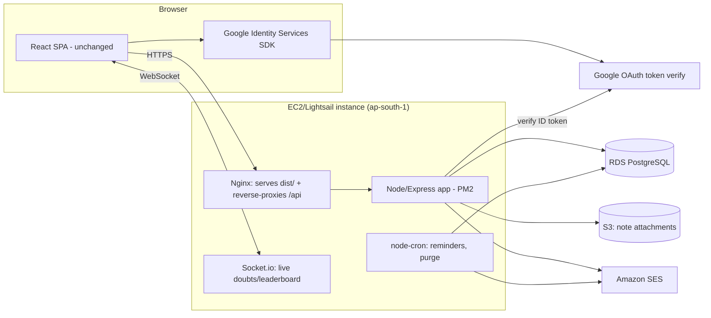

# NCERT Prep — AWS EC2/Lightsail Migration Plan (credits-funded)

| | |
|---|---|
| **Decision** | Full move off Firebase. **One Node/Express server on EC2 or Lightsail**, **RDS PostgreSQL**, **Google Identity Services** for sign-in with your own sessions. No Amplify, no AppSync, no Lambda. |
| **Region** | `ap-south-1` (Mumbai) |
| **Why not the Amplify/serverless plan** (`AWS_MIGRATION_PLAN.md`) | That plan traded simplicity for pay-per-use cost efficiency — 17 Lambdas, GraphQL auth rules, DynamoDB access-pattern modeling. With ~2 years of AWS credits, idle cost stops being the constraint, so the simpler design (one server, one relational DB) wins: less code, easier to debug solo, ordinary SQL instead of NoSQL key design. |
| **UI/theme impact** | **None.** Every change here is inside `src/services/*` (API calls) and a new `server/` directory. Pages, components, Tailwind theme, routing — untouched. |
| **Status** | Plan only. Nothing built yet. |

---

## 1. What changes, at a glance

| Today (Firebase) | New target | Why |
|---|---|---|
| Firebase Auth (Google + email/password) | **Google Identity Services JS SDK** (same underlying Google OAuth Firebase uses) + email/password handled by your own Express routes (bcrypt + SES verification) | Removes Firebase entirely; keeps the same popup-style Google sign-in UX |
| Cloud Firestore | **RDS PostgreSQL** (single database, ordinary tables/foreign keys) | Data is inherently relational (users → progress → XP → doubts) |
| Firestore `onSnapshot` (live doubts/leaderboard) | **Socket.io** on the same Express server | One in-process WebSocket layer, no extra service |
| 13 Cloud Functions | **Express route handlers** in one app | Same logic, no per-function cold starts or IAM wiring to manage |
| Cloud Scheduler (reminders, purge) | **node-cron** inside the same process | No EventBridge needed for a single server |
| Firebase Storage | **S3** (pre-signed PUT for admin uploads; public bucket + CloudFront for reads, same as today's "readable by anyone with the link") | Unchanged from the earlier plan — S3 is the right tool regardless of compute choice |
| Firebase Hosting/Amplify Hosting | **Same EC2/Lightsail box serves the built SPA** via Nginx (reverse-proxying `/api/*` to the Node app) | One server, one deploy, no separate CDN to wire up initially |
| App Check (reCAPTCHA) | **reCAPTCHA v3, verified server-side** in Express | Same protection, no Firebase SDK needed for it |
| Resend/SES | **Amazon SES** | Unchanged |

---

## 2. Architecture



**Auth flow:** Google button returns an ID token → POST `/api/auth/google` → Express verifies it with `google-auth-library` → upsert row in `users` → issue an HttpOnly, signed session cookie → every API call authenticated by a cookie middleware (session id looked up in a `sessions` table, or a signed JWT — plain signed cookie is enough at this scale, no Redis needed). Email/password path: `/api/auth/register` (bcrypt hash + SES verification email), `/api/auth/login`, `/api/auth/reset-password` — logic ported directly from the existing Firebase Cloud Functions equivalents.

---

## 3. Database (RDS PostgreSQL) — table sketch

| Table | Key columns | Replaces |
|---|---|---|
| `users` | id (uuid), email, google_id, password_hash?, role, xp, streak, consent_status, reminder settings | `users/{uid}` |
| `lesson_progress` | user_id, youtube_id, completed, favorited, watched_at | `users/{uid}/user_progress` |
| `xp_transactions` | id, user_id, amount, reason, created_at | `users/{uid}/xp_transactions` |
| `videos` | youtube_id, class, subject, chapter, title, order | `videos` |
| `curriculum_classes/subjects/chapters` | id, parent_id, name, order | `classes`/`subjects`/`chapters` |
| `chapter_notes` | id, chapter_key, class, is_published, attachment_url | `notes` |
| `doubts` | id, user_id, status, created_at, answered_at | `doubts` |
| `feedback` | id, user_id, status, rating, created_at | `feedback` |
| `consent_requests` | token, user_id, status, expires_at | `consent_requests` |
| `stats_daily` / `stats_totals` | day / singleton row | `stats_daily`/`stats` |
| `app_settings` | key, value(jsonb) | `platformConfig` |

Leaderboard = a query (`SELECT ... FROM users WHERE class = $1 ORDER BY xp DESC`) instead of a maintained `leaderboard` collection — one less thing to keep in sync. Rate limiting = a small `rate_limits` table with a unique `(key, window)` constraint, cleaned by the same cron job that purges unconsented accounts.

---

## 4. Repository structure (new)

```
server/                        # new — replaces amplify/ and functions/
├── src/
│   ├── index.ts                # Express app + Socket.io + node-cron bootstrap
│   ├── db.ts                   # pg Pool
│   ├── middleware/auth.ts      # session cookie verification
│   ├── routes/
│   │   ├── auth.ts             # google, register, login, reset-password
│   │   ├── doubts.ts, feedback.ts, progress.ts, xp.ts, leaderboard.ts
│   │   ├── consent.ts, admin.ts, notes.ts, videos.ts, uploads.ts
│   ├── jobs/
│   │   ├── reminder-job.ts     # node-cron, hourly
│   │   └── purge-unconsented.ts # node-cron, daily
│   └── shared/erase-user.ts    # one place deleting every table row for a user
├── migrations/                 # SQL migration files (node-pg-migrate or Drizzle)
└── package.json
src/                             # React app — UNCHANGED except services/
├── services/
│   ├── auth.ts                 # was firebase.ts: Google Identity SDK + fetch() calls to /api/auth/*
│   ├── api/client.ts            # fetch wrapper, credentials: 'include' for the session cookie
│   └── ... (content.ts, xpService.ts, leaderboard.ts, stats.ts — same exports, new implementation)
```

**Removed after cutover:** `functions/`, `firestore.rules`, `firestore.indexes.json`, `storage.rules`, Firebase SDK imports, `localStorage` demo mode.

---

## 5. Deployment

- **One Lightsail instance** (2 GB plan is plenty to start) running: Nginx (serves `dist/` + proxies `/api` and `/socket.io` to Node), Node app under **PM2** (auto-restart), Postgres client only (DB itself is RDS, not on-box, for automated backups).
- **RDS PostgreSQL** `db.t3.micro`, `ap-south-1`, automated daily snapshots.
- **TLS** via Let's Encrypt/Certbot on Nginx, or put the instance behind CloudFront/ACM if you want a CDN later (skip initially — YAGNI until traffic needs it).
- **CI/CD**: GitHub Actions builds the SPA + server, then `rsync`/`scp` + `pm2 reload` over SSH. No Amplify build pipeline needed.
- **Secrets**: `.env` on the instance (DB URL, SES creds, Google OAuth client ID, session signing secret, reCAPTCHA secret) — or AWS Secrets Manager if you want them out of the filesystem later.

---

## 6. What still needs a decision later (not blocking analysis)

- Email/password signup was previously "free" via Firebase Auth; on Express it's ~a day of work (bcrypt, verification email via SES, reset flow) — small but real added scope versus the serverless plan, which also kept Firebase Auth for this.
- Socket.io on a single instance is fine now; if you ever run more than one instance behind a load balancer, it needs the Redis adapter (`ponytail: single-instance Socket.io, add Redis adapter only if you horizontally scale`).
- Session store: signed cookie (stateless) vs. a `sessions` table (revocable). Recommend starting stateless; add the table only if you need forced logout/admin revocation.

---

## 7. Rough migration order (adapt from the superseded plan's phases, same features, different plumbing)

1. `server/` scaffold: Express + Postgres + Google auth + session cookie, ported `users` table. Exit: sign in with Google, read/write your own profile.
2. Catalogue & content: videos, curriculum, notes tables + S3 uploads. Exit: admin uploads a note, students see published notes.
3. Progress, XP, leaderboard tables + routes.
4. Doubts & feedback + Socket.io live updates.
5. Consent, reminders (node-cron), deletion, stats.
6. Remove all Firebase imports and demo mode; point DNS at the Lightsail instance.
7. Load test, backups check, security pass (SQL injection via parameterized queries only, rate limiting, CSP header — still missing per the audit).

Each phase is smaller than its Amplify-plan counterpart because there's no GraphQL schema or IAM per-function wiring to write — it's routes and SQL.
