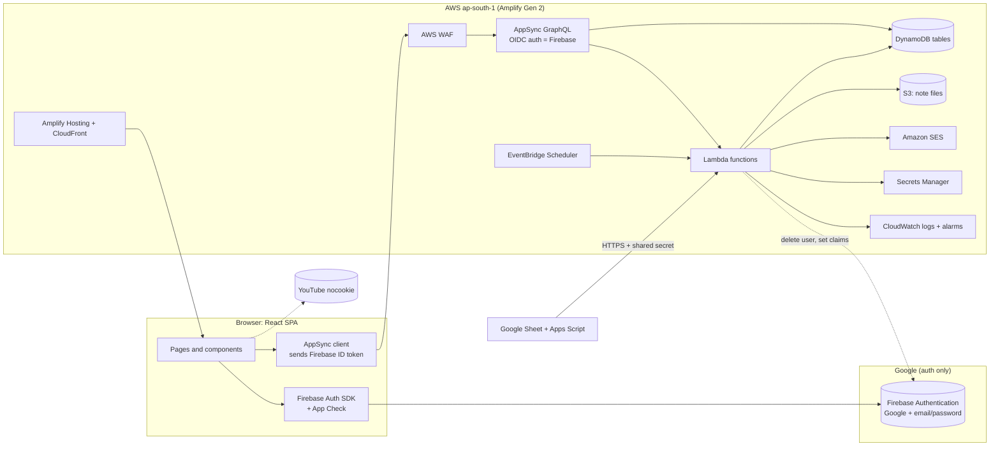

> **Superseded 23 September 2026** — the project now has ~2 years of AWS credits, which removes the cost pressure that ruled out EC2/Lightsail below. See **[`AWS_EC2_MIGRATION_PLAN.md`](./AWS_EC2_MIGRATION_PLAN.md)** for the current plan (EC2/Lightsail + RDS Postgres + Google Identity Services, full Firebase removal). This file is kept for reference only.

# NCERT Prep — AWS Deployment & Migration Plan

| | |
|---|---|
| **Decision** | **Firebase Authentication** for sign-in. **Everything else on AWS**, provisioned with **Amplify Gen 2** (serverless: no EC2, no Lightsail) |
| **Region** | AWS `ap-south-1` (Mumbai) for all resources |
| **Status** | Plan. Nothing in `amplify/` exists yet; the app still runs on the Firebase backend described in `DEPLOYMENT.md` |
| **Written against** | The codebase on 22 September 2026 |
| **Estimate** | About **6–7 weeks** for one developer, including testing (§12) |

> **Why serverless, not EC2 or Lightsail.** EC2 and Lightsail are servers you patch, secure, back up and scale yourself. A single Lightsail box also has a fixed ceiling that exam-season evening peaks would hit. The app's workload is small requests plus a few scheduled jobs, so Lambda, AppSync and DynamoDB fit it and cost almost nothing when idle.

---

## Contents

1. Decisions to confirm
2. Target architecture
3. Service mapping
4. Repository structure
5. Authentication design (Firebase → AWS)
6. Data design (DynamoDB via AppSync)
7. Functions inventory
8. File storage (S3)
9. Email (SES)
10. Environments and CI/CD
11. Configuration reference
12. Migration phases
13. Launch and cutover
14. Testing plan
15. Monitoring, backups and rollback
16. Security and privacy checklist
17. Cost estimate
18. Risks and open questions

---

## 1. Decisions to confirm

| # | Decision | Recommendation | Why |
|---|---|---|---|
| D1 | Launch timing | **Build on AWS first, then launch.** | There is no production data yet (seed data was removed), so there is nothing to migrate. Launching on Firebase first means a live data migration later (§13.2) |
| D2 | Admin role | Firebase **custom claim** `groups: ["admin"]` set with the Admin SDK | AWS reads it straight from the signed token; no database lookup per request. Replaces `users/{uid}.role` |
| D3 | Email | **Amazon SES** | Stays inside AWS and costs $0.10 per 1,000 emails. Needs "production access" approval (about a day). Keeping Resend is fine if you prefer |
| D4 | Demo mode (no-backend `localStorage` path) | **Remove**; each developer uses an Amplify **sandbox** (a personal cloud backend) | Every service currently has two code paths. Keeping demo mode doubles the migration work and keeps a way to ship fake data |
| D5 | Bot protection | **AWS WAF** on AppSync, plus **Firebase App Check** tokens verified inside Lambda for sensitive actions | App Check only protects Firebase products natively; WAF covers the AWS API |
| D6 | Staging | A `dev` branch with its own AWS stack **and its own Firebase project** | Test accounts never touch production data |

## 2. Target architecture



**Request flow:** the browser signs in with Firebase and gets an ID token (valid for 1 hour, refreshed automatically). Every AppSync call sends that token. AppSync checks it against Firebase's public keys (issuer `https://securetoken.google.com/<firebase-project-id>`, audience `<firebase-project-id>`), then applies the per-table access rules. Actions that need more than a rule (rate limits, XP, consent, deletion) go to a Lambda.

## 3. Service mapping

| Today (Firebase) | Target | Notes |
|---|---|---|
| Firebase Auth | **Firebase Auth (unchanged)** | Only the sign-in part of `src/services/firebase.ts` stays |
| Firestore + `onSnapshot` | DynamoDB + AppSync queries, mutations and **subscriptions** | Live doubts, bell and admin queues use subscriptions |
| `firestore.rules` | AppSync authorization rules + Lambda checks | §6.3 |
| Firebase Storage | S3 via **pre-signed URLs** from a Lambda, served through CloudFront | §8 |
| Cloud Functions (13) | Lambda (13 + `award-xp` + `sheet-sync` + `upload-url`) | §7 |
| Cloud Scheduler | EventBridge Scheduler (schedules are in **UTC**) | Hourly `cron(0 * * * ? *)`; daily purge `cron(0 22 * * ? *)` = 03:30 IST |
| Firestore trigger `countLessonProgress` | Counter updated inside the progress mutation's Lambda (or DynamoDB Streams) | Simpler than a stream for one counter |
| Auth trigger `countRegistration` | Counted when the user's profile row is first created | Firebase Auth triggers don't reach AWS |
| Secret Manager | AWS Secrets Manager via `npx ampx secret set` | §11 |
| App Check enforcement | WAF + App Check token check in Lambda | D5 |
| Resend | SES (D3) | §9 |
| Apps Script → Firestore REST | Apps Script → `sheet-sync` Lambda URL | The service-account key leaves the sheet |
| Firebase Hosting / Vercel | Amplify Hosting | Already configured (`amplify.yml`, `customHttp.yml`) |

## 4. Repository structure

```
ncert-prep/
├── amplify/                              # AWS backend (Amplify Gen 2, TypeScript)
│   ├── backend.ts                        # defineBackend(...), WAF, schedules, IAM grants, outputs
│   ├── auth/
│   │   └── firebase-oidc.ts              # issuer, audience (Firebase project id), token lifetimes
│   ├── data/
│   │   ├── resource.ts                   # defineData: schema, OIDC as the default auth mode
│   │   └── schema/                       # one file per area: catalogue, progress, doubts, consent, stats
│   ├── storage/
│   │   └── resource.ts                   # S3 bucket + CloudFront for note attachments
│   ├── functions/
│   │   ├── ask-doubt/{resource,handler}.ts
│   │   ├── answer-doubt/                 # transaction: refuse if already answered
│   │   ├── submit-feedback/
│   │   ├── record-progress/              # progress + streak + lesson counter
│   │   ├── award-xp/                     # lesson, focus block (≥15 min, daily cap), streak bonus
│   │   ├── leaderboard/                  # "my class only" query
│   │   ├── consent-record-adult/
│   │   ├── consent-request-parent/       # sends SES email
│   │   ├── consent-get-request/          # public (parent's link)
│   │   ├── consent-decide/
│   │   ├── purge-unconsented/            # EventBridge daily
│   │   ├── reminder-job/                 # EventBridge hourly
│   │   ├── unsubscribe/                  # public Lambda function URL
│   │   ├── delete-account/               # erase all tables + Firebase Auth user
│   │   ├── set-admin/                    # admin-only: grant/revoke the admin claim
│   │   ├── upload-url/                   # admin-only: pre-signed S3 PUT
│   │   ├── track-visit/                  # anonymous visitor counter
│   │   └── sheet-sync/                   # upsert videos from the Google Sheet
│   └── shared/
│       ├── firebase-admin.ts             # Admin SDK init from Secrets Manager (delete user, claims, App Check)
│       ├── erase-user.ts                 # one place that deletes every piece of a user's data
│       ├── rate-limit.ts                 # DynamoDB conditional writes with TTL
│       ├── catalog.ts                    # next-lesson logic shared by reminders (moved from functions/src)
│       └── email-templates.ts
├── src/                                  # React app: pages, components and contexts stay as they are
│   ├── services/
│   │   ├── auth/firebase.ts              # Firebase Auth + App Check only
│   │   ├── api/client.ts                 # generateClient() with the Firebase ID token as the OIDC token
│   │   ├── catalog.ts                    # was firestore.ts (videos) + useCatalog loading
│   │   ├── content.ts                    # notes, curriculum, doubts: same exports, AppSync inside
│   │   ├── progress.ts, xp.ts, leaderboard.ts, dashboardControl.ts, stats.ts
│   │   └── storage.ts                    # browser cache only (no data store)
│   └── ...
├── scripts/
│   ├── google-apps-script-sync.js        # now POSTs rows to sheet-sync
│   └── grant-admin.ts                    # one-off: first admin claim (Firebase Admin SDK)
├── amplify.yml                           # backend (ampx pipeline-deploy) + frontend build
├── customHttp.yml                        # security headers
├── docs/
└── test/
```

**Removed after cutover:** `functions/`, `firestore.rules`, `firestore.indexes.json`, `storage.rules`, the `firestore`/`functions`/`storage` blocks of `firebase.json`, and the `localStorage` demo paths in `src/services/*` (D4).

Pages and components keep calling the same service functions (`DoubtsService.subscribeMine`, `NotesService.save`…). Only what happens inside `src/services/` changes, which keeps the UI work small.

## 5. Authentication design (Firebase → AWS)

| Item | Design |
|---|---|
| Sign-in | Unchanged: Google and email/password with verification, in `AuthContext.tsx` |
| Token to AWS | `auth.currentUser.getIdToken()` is passed to the AppSync client as the OIDC token; the client refreshes it before expiry |
| AppSync OIDC settings | Issuer `https://securetoken.google.com/<firebase-project-id>`, client id / audience `<firebase-project-id>`, token lifetime 3600 s |
| Identity used in rules | `sub` (= Firebase uid) for ownership |
| Admin | Custom claim `groups: ["admin"]`, set by `scripts/grant-admin.ts` (first admin) and the `set-admin` Lambda (later), both with the Firebase Admin SDK. Takes effect at the next token refresh (≤ 1 hour, or sign out and in) |
| Firebase Admin credentials on AWS | A Firebase service-account key in Secrets Manager (`FIREBASE_SERVICE_ACCOUNT`), read only by `delete-account`, `set-admin` and functions that verify App Check |
| Recent sign-in for deletion | `delete-account` checks the token's `auth_time` is under 5 minutes old (same rule as today) |
| Consent gate | Consent status stays on the user row; Lambdas refuse processing until `consent.status = granted` (same as `requireConsent` today) |

**Verify in phase 1:** the exact Amplify Gen 2 syntax for OIDC owner rules (`identityClaim('sub')`) and group rules on a custom claim (`groups`), in a sandbox, before building on them.

## 6. Data design (DynamoDB via AppSync)

### 6.1 Models (one DynamoDB table each, on-demand capacity, point-in-time recovery on)

| Model | Key | Secondary indexes (queries they serve) | Replaces |
|---|---|---|---|
| `Video` | `youtubeId` | `byClass` (classSort) | `videos` |
| `CurriculumClass` / `CurriculumSubject` / `CurriculumChapter` | `id` | `byClass` | `classes`, `subjects`, `chapters` |
| `ChapterNote` | `id` (chapter key) | `byClassPublished` (classSort, isPublished) | `notes` |
| `AppSetting` | `id` (`student_dashboard`, `platform`) | – | `settings/*` |
| `UserProfile` | `userId` | `byReminder` (remindersEnabled#frequency, reminderHour); `byClass` (gradePreference) for counts | `users/{uid}` |
| `LessonProgress` | `userId` + `youtubeId` | – | `users/{uid}/user_progress` |
| `XpTransaction` | `userId` + `timestamp#id` | – | `users/{uid}/xp_transactions` |
| `LeaderboardEntry` | `userId` | `byClassXp` (classSort, xp) sorted descending | `leaderboard` |
| `Doubt` | `id` | `byUser` (userId, createdAt); `byStatus` (status, createdAt) | `doubts` |
| `Feedback` | `id` | `byStatus` (status, createdAt); `byUser` (for erasure) | `feedback` |
| `ConsentRequest` | `token` | `byStatusExpiry` (status, expiresAt) | `consent_requests` |
| `StatsDaily` / `StatsTotal` | `day` / `id` | – | `stats_daily`, `stats` |
| `Visitor` | `visitorId` | – (TTL attribute) | `visitors` |
| `RateLimit` | `key` (`doubts#uid`…) | – (TTL attribute) | `rate_limits` |

### 6.2 Live updates
AppSync subscriptions (WebSocket, same Firebase token) replace `onSnapshot` for: the student's own doubts (bell and Doubts page), admin open-doubts and feedback counts, and dashboard settings.

### 6.3 Access rules
| Data | Student | Admin | Lambda only |
|---|---|---|---|
| Video, curriculum, published notes, settings | Read | Read, write | Sheet sync writes videos |
| Own profile | Read, update (not `groups`, not consent) | Read all | Consent fields |
| Own progress | Read, write | Read | Counters |
| Own XP transactions | Read | Read | **Write** (fixes the client-XP gap) |
| Leaderboard | **Own class only**, through the `leaderboard` query Lambda | Any class | Write |
| Doubts | Read own; mark read / close | Read all, reply | Create (`ask-doubt`, rate-limited) |
| Feedback | – | Read, review | Create (`submit-feedback`, rate-limited) |
| Consent requests, stats, visitors, rate limits | – | Read stats | Everything else |

## 7. Functions inventory

| Function | Trigger | Secrets | Replaces |
|---|---|---|---|
| `ask-doubt` | AppSync mutation | – | `askDoubt` |
| `answer-doubt` | AppSync mutation (admin) | – | direct admin write |
| `submit-feedback` | AppSync mutation | – | `submitFeedback` |
| `record-progress` | AppSync mutation | – | client write + `countLessonProgress` |
| `award-xp` | Called by `record-progress` and the focus-block mutation | – | client XP writes |
| `leaderboard` | AppSync query | – | client query |
| `consent-record-adult` | AppSync mutation | – | `recordAdultConsent` |
| `consent-request-parent` | AppSync mutation | – (SES via IAM) | `requestParentalConsent` |
| `consent-get-request` | AppSync query, public (API key or IAM) | – | `getParentalConsentRequest` |
| `consent-decide` | AppSync mutation | `FIREBASE_SERVICE_ACCOUNT` (decline erases the user) | `decideParentalConsent` |
| `purge-unconsented` | EventBridge `cron(0 22 * * ? *)` | `FIREBASE_SERVICE_ACCOUNT` | `purgeUnconsentedChildren` |
| `reminder-job` | EventBridge `cron(0 * * * ? *)`, timeout 9 min | `UNSUBSCRIBE_SECRET` | `reminderJob` |
| `unsubscribe` | Lambda function URL (public, HMAC-signed link) | `UNSUBSCRIBE_SECRET` | `unsubscribe` |
| `delete-account` | AppSync mutation | `FIREBASE_SERVICE_ACCOUNT` | `deleteAccount` |
| `set-admin` | AppSync mutation (admin) | `FIREBASE_SERVICE_ACCOUNT` | Firebase Console role edit |
| `upload-url` | AppSync mutation (admin) | – | Storage SDK upload |
| `track-visit` | AppSync mutation (public, rate-limited) | – | `trackVisit` |
| `sheet-sync` | Lambda function URL, `Authorization: Bearer <SHEET_SYNC_SECRET>` | `SHEET_SYNC_SECRET` | Apps Script → Firestore REST |

All functions: Node.js 22, `ap-south-1`, least-privilege IAM (each function gets only the tables it touches), structured logs to CloudWatch.

`shared/erase-user.ts` deletes: profile, progress, XP transactions, leaderboard entry, doubts, feedback, rate limits and consent requests, then the Firebase Auth user. It is used by `delete-account`, `consent-decide` (decline) and `purge-unconsented`. That preserves the DPDP fix made on 22 September 2026.

## 8. File storage (S3)

- One private bucket `ncert-prep-notes-<env>`, block all public access, versioning on.
- **Upload (admin):** `upload-url` returns a pre-signed PUT URL (10 minutes, content type PDF/PNG/JPEG/WEBP, max 20 MB via a signed content-length condition). The browser uploads directly.
- **Download:** CloudFront in front of the bucket with Origin Access Control. Notes documents store the CloudFront URL (same "readable by anyone with the link" behaviour as today).
- Pre-signed URLs avoid needing AWS credentials in the browser, which Amplify's storage client would otherwise get from Cognito (not used here).

## 9. Email (SES)

1. SES in `ap-south-1` → verify the sending domain with **Easy DKIM**; set a **custom MAIL FROM** subdomain for SPF; publish DMARC (`v=DMARC1; p=none; rua=...`, tighten later).
2. Request **production access** (leave the SES sandbox), stating the use: opt-in reminders and parental-consent emails, with one-click unsubscribe.
3. Configure a **configuration set** with bounce and complaint notifications (SNS) and turn off reminders for addresses that bounce.
4. `EMAIL_FROM` = `NCERT Prep <revision@your-domain>`.

## 10. Environments and CI/CD

| Environment | Git branch | AWS | Firebase project |
|---|---|---|---|
| Personal dev | any | `npx ampx sandbox` (one per developer) | `ncert-prep-dev` |
| Staging | `dev` | Amplify branch deployment (own stack and tables) | `ncert-prep-dev` |
| Production | `main` | Amplify branch deployment | `ncert-prep-prod` |

`amplify.yml` after phase 1 (backend deploys first, then the frontend reads `amplify_outputs.json`):

```yaml
version: 1
backend:
  phases:
    build:
      commands:
        - nvm install 22 && nvm use 22
        - npm ci --cache .npm --prefer-offline
        - npx ampx pipeline-deploy --branch $AWS_BRANCH --app-id $AWS_APP_ID
frontend:
  phases:
    build:
      commands:
        - npm test
        - npm run build
  artifacts:
    baseDirectory: dist
    files:
      - '**/*'
  cache:
    paths:
      - .npm/**/*
      - node_modules/**/*
```

Pull requests: Amplify **preview deployments** (enable per branch pattern), pointed at staging data only.

## 11. Configuration reference

### 11.1 Frontend environment variables (Amplify console → Hosting → Environment variables)
| Variable | Value |
|---|---|
| `VITE_FIREBASE_API_KEY`, `VITE_FIREBASE_AUTH_DOMAIN`, `VITE_FIREBASE_PROJECT_ID`, `VITE_FIREBASE_APP_ID` | Firebase web app config (sign-in only). `STORAGE_BUCKET`, `MESSAGING_SENDER_ID` and `FUNCTIONS_REGION` are no longer needed |
| `VITE_RECAPTCHA_V3_SITE_KEY` | App Check site key |
| `VITE_GRIEVANCE_OFFICER_NAME`, `VITE_GRIEVANCE_EMAIL` | DPDP grievance contact |
| AppSync endpoint, region, auth mode | **Not variables**: generated into `amplify_outputs.json` by the backend build |

### 11.2 Backend secrets (`npx ampx secret set <NAME>` per branch, or Amplify console → Secrets)
| Secret | Value |
|---|---|
| `FIREBASE_SERVICE_ACCOUNT` | JSON key of a Firebase service account with **Firebase Authentication Admin** only |
| `FIREBASE_PROJECT_ID` | Used for OIDC issuer/audience and App Check verification |
| `UNSUBSCRIBE_SECRET` | `openssl rand -base64 48` |
| `SHEET_SYNC_SECRET` | `openssl rand -base64 48`, also stored in the sheet's Script Properties |
| `APP_URL` | Production URL, e.g. `https://ncertprep.in` |
| `EMAIL_FROM` | Verified SES sender |

### 11.3 Firebase console (auth project)
Authentication → Google and Email/Password on; authorized domains: production domain and the `amplifyapp.com` branch domains; App Check with reCAPTCHA v3. Firestore, Storage and Functions are **not used** in the target setup.

## 12. Migration phases

Each phase ends with its features working end to end on staging. Estimates are for one developer.

| Phase | Scope | Exit criteria | Estimate |
|---|---|---|---|
| **0. Accounts** | AWS account with MFA, billing alarms, IAM user for Amplify, `ap-south-1`; second Firebase project for staging; SES domain verification started | Budgets and alarms in place; SES production access requested | 2–3 days |
| **1. Scaffold + auth** | `amplify/` with OIDC data auth, `UserProfile` model, `grant-admin` script, AppSync client in `src/services/api`, sandbox working; new `amplify.yml` | A signed-in Firebase user reads and writes only their own profile; an admin claim holder can read all profiles; a forged or expired token is rejected | 3–4 days |
| **2. Catalogue & content** | `Video`, curriculum, `ChapterNote`, `AppSetting` models; `sheet-sync`; S3 + `upload-url`; admin Videos, Classes & Chapters, Notes, Dashboard Control on AWS | Sheet sync fills the catalogue; admin uploads a note PDF; students see published notes only | 1 week |
| **3. Progress, XP, leaderboard** | `LessonProgress`, `XpTransaction`, `LeaderboardEntry`; `record-progress`, `award-xp`, `leaderboard`; focus-block XP with daily cap | Students cannot write XP directly; leaderboard only shows their own class; progress syncs across devices | 1 week |
| **4. Doubts & feedback** | `Doubt`, `Feedback`, `RateLimit`; `ask-doubt`, `answer-doubt`, `submit-feedback`; subscriptions for the bell and admin queues | Reply appears for the student without a refresh; 11th doubt in a day is refused | 4–5 days |
| **5. Consent, reminders, deletion, stats** | Consent functions + SES, `purge-unconsented`, `reminder-job`, `unsubscribe`, `delete-account`, `track-visit`, stats models; admin Overview on AWS | Full under-18 flow works; reminder email arrives at the chosen IST hour; deletion removes every table's data and the Firebase user | 1 week |
| **6. Remove Firebase backend** | Delete `functions/`, rules, indexes, Firestore/Storage SDK usage and demo mode (D4); update docs and tests | `grep` finds no `firebase/firestore`, `firebase/storage` or `firebase/functions` imports | 2–3 days |
| **7. Hardening & launch** | WAF rules, alarms, load test, security review, DPDP review, §14 test pass | §13 go-live checklist complete | 1 week |

## 13. Launch and cutover

### 13.1 Recommended: launch directly on AWS (D1)
No production data exists yet, so there is nothing to migrate. After phase 7: run the Sheet sync on production, grant the first admin claim, create the curriculum records, run the smoke test (§14.3), then point the domain at Amplify.

### 13.2 If you launch on Firebase first
1. Announce a short maintenance window. Put the site in read-only mode (a flag in `AppSetting`).
2. Export Firestore (`gcloud firestore export gs://...`), transform with a one-off script (field renames: `class_sort` → `classSort`, timestamps → ISO strings, subcollections → keyed rows), and batch-write to DynamoDB.
3. Verify row counts and spot-check 20 users (progress, XP, doubts) against Firestore.
4. Deploy the AWS-backed frontend; Firebase Auth accounts keep working because auth doesn't change.
5. Keep Firestore read-only for 30 days, then delete it.

## 14. Testing plan

### 14.1 Automated
- Existing `npm test` (19 tests) stays green in every build.
- Add unit tests for `shared/erase-user.ts`, `award-xp` rules (skip earns nothing, 15-minute minimum, daily cap), `rate-limit.ts` and the reminder hour logic (IST vs UTC).
- Authorization tests against a sandbox: student A cannot read student B's profile, progress, doubts or another class's leaderboard; a non-admin cannot call admin mutations.

### 14.2 Load
Simulate an exam-season evening: 3,000 concurrent students, 25 writes/second, doubts and progress bursts (Artillery or k6 against staging). Watch AppSync latency, Lambda throttles and DynamoDB throttling (on-demand should absorb it).

### 14.3 Smoke test (production)
Same list as `DEPLOYMENT.md` §12, plus: token expiry during a long session refreshes silently; admin claim revocation takes effect after re-sign-in; S3 note links open through CloudFront.

## 15. Monitoring, backups and rollback

| Area | Setup |
|---|---|
| Alarms | CloudWatch: Lambda errors > 0 for 5 min, AppSync 5xx, DynamoDB throttles, `reminder-job` and `purge-unconsented` failures, SES bounce rate > 5% |
| Tracing | X-Ray on AppSync and Lambda |
| Backups | DynamoDB point-in-time recovery (35 days) on every table; AWS Backup daily plan with 30-day retention; S3 versioning |
| Costs | AWS Budgets alerts at 50%, 80%, 100% |
| Frontend rollback | Amplify → branch → redeploy the previous build |
| Backend rollback | Revert the commit and push; Amplify redeploys the stack. Data changes need a restore from point-in-time recovery |
| Schema changes | Additive only in production (new fields and indexes); never rename a live table |

## 16. Security and privacy checklist

- [ ] Every DynamoDB table has an explicit AppSync rule; nothing uses public API-key access except `consent-get-request` and `track-visit`
- [ ] XP, leaderboard, doubts, feedback and consent are written only by Lambda
- [ ] Leaderboard is readable only for the student's own class; consider first name + last initial for under-18s
- [ ] Firebase service-account key has only the Firebase Authentication Admin role and lives only in Secrets Manager
- [ ] `erase-user` covers every table that stores a `userId`; tested
- [ ] All data in `ap-south-1` (DPDP); S3 bucket private with CloudFront OAC
- [ ] WAF: AWS managed common rules, rate-based rule per IP on AppSync, Bot Control (common)
- [ ] App Check token verified in `ask-doubt`, `submit-feedback`, consent functions and `delete-account`
- [ ] Sheet sync secret rotated if the sheet is shared outside the content team
- [ ] Content-Security-Policy added to `customHttp.yml` (report-only first)

## 17. Cost estimate

Rough monthly figures at the design point in `ARCHITECTURE.md` (100,000 registered, 20,000 daily active). Check with the AWS Pricing Calculator before launch.

| Service | Driver | Estimate (USD/month) |
|---|---|---|
| AppSync | ~15 M queries/mutations + real-time connection minutes | 60–90 |
| Lambda | ~5 M invocations, mostly under 200 ms | 5–15 |
| DynamoDB (on-demand) | ~20 M reads, ~3 M writes, a few GB | 15–30 |
| S3 + CloudFront | Note PDFs, low traffic | 5–15 |
| Amplify Hosting | Builds + ~200 GB transfer | 20–40 |
| SES | Reminders (~300k/month) | 30 |
| WAF | Web ACL + rules + requests | 15–25 |
| CloudWatch | Logs and alarms | 10–20 |
| Firebase Auth | Email/password and Google sign-in | Free tier (no SMS) |
| **Total** | | **≈ 160–265** |

Videos stream from YouTube, which is why these stay low. Early on, with a few thousand students, expect well under $50 per month.

## 18. Risks and open questions

| Risk | Mitigation |
|---|---|
| Amplify Gen 2 OIDC rule syntax differs from assumptions | Prove it in phase 1 before building models on it |
| Admin claim changes take up to an hour | Tell admins to sign out and in; `set-admin` also revokes refresh tokens |
| Two vendors for one login path (Google for auth, AWS for data) | Both have strong uptime; monitor Firebase status in the runbook |
| SES production access delayed | Request in phase 0; keep Resend as a fallback until approved |
| Real-time subscription costs grow with idle open tabs | Subscribe only on pages that need it; unsubscribe on tab hide |
| Scope creep during the rewrite | Pages and components stay; only `src/services/` changes |

**Open questions for you:** D1–D6 in §1, the production domain name, and who owns the AWS and Firebase accounts (billing and MFA).
