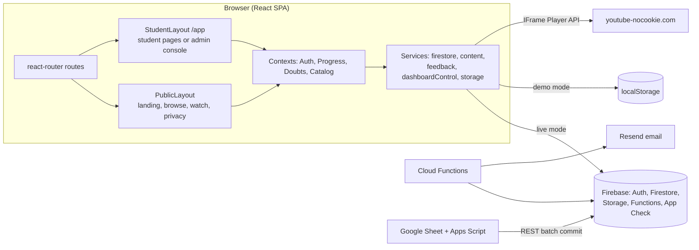
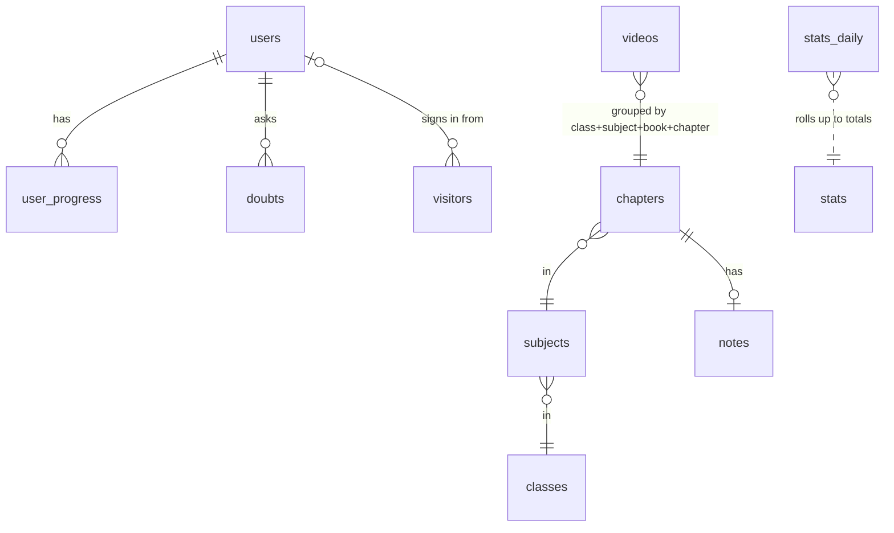

# NCERT Prep — Code Analysis, FRD and SRS

| | |
|---|---|
| **Document** | Consolidated code analysis + Functional Requirements (FRD) + System & Software Requirements (SRS) |
| **Codebase snapshot** | commit `8613b99` + working tree, 21 September 2026 |
| **Supersedes** | `FRD.md` v1.4 and `SRS.md` v2.4 where they differ (those files predate the router rebuild and the dashboard-control commit) |
| **Status legend** | ✅ implemented · 🟡 partial / has a known gap · ❌ not implemented |

> **Naming note:** "NCERT Prep" is working branding. The app uses NCERT-aligned content but is not affiliated with NCERT. Confirm name and trademark clearance before launch.

---

## Contents

- **Part A — Code analysis**
  - A1 Summary · A2 Architecture · A3 Module map · A4 Runtime flows · A5 Quality metrics · A6 Findings (ranked) · A7 Tech debt · A8 Recommendations
- **Part B — Functional Requirements (FRD)**
  - B1 Actors · B2 Route map · B3 Requirements FR-1…FR-18 · B4 Traceability · B5 QA plan · B6 Out of scope
- **Part C — System & Software Requirements (SRS)**
  - C1 Scope · C2 Architecture · C3 Tech stack · C4 Data model · C5 Security model · C6 Integrations · C7 NFRs · C8 Configuration & deployment · C9 Assumptions · C10 Content sheet contract

---

# Part A — Code analysis

## A1. Summary

NCERT Prep is a React 19 + TypeScript single-page app on Firebase (Auth, Firestore, Storage, Cloud Functions). It organises YouTube revision videos by Class → Subject → Chapter, tracks progress, and adds notes, private doubts, reminders and an admin console. It also runs fully offline in a **demo mode** (no Firebase keys) backed by `localStorage`.

**Overall health:** builds cleanly (`tsc` + `vite build`), 8/8 tests pass, `npm audit` reports 0 vulnerabilities. Architecture is sound for an MVP.

**Most important issues (details in A6):**

1. ~~**Admin detection by email**~~ Fixed: admin comes only from `users.role`.
2. ~~**Demo login buttons are always visible**~~ Fixed: sign-in is Google only; demo accounts exist only without Firebase keys, and live mode never restores a browser-stored demo session.
3. ~~**Dashboard Control does not work in production.**~~ Fixed: `settings/*` rule added and save errors are now shown to the admin.
4. **Free-preview policy settings have no effect.** Admin toggles are saved but the gating code ignores them.
5. **Tests copy logic instead of importing it**, so they cannot catch regressions in the real code.
6. **Bundle size**: 610 kB app chunk + 618 kB Firebase chunk (≈316 kB gzip total). No route-level code splitting; admin code ships to every student.

## A2. Architecture

**Key design decisions (as built):**

- **Dual backend per service.** Every service method checks `isFirebaseConfigured` and either calls Firebase or `localStorage`. This powers zero-config demos but doubles the code paths to test.
- **Contexts as state layer.** `AuthContext` (session, profile, streak), `ProgressContext` (completed/favourites/last watched), `DoubtsContext` (live doubt subscription), `CatalogContext` (videos + curriculum overlay, loaded once).
- **Curriculum overlay.** Videos come from the Google Sheet. Optional `classes/subjects/chapters` records rename, reorder and hide items (`useCatalog`).
- **Server-only writes for abuse-prone data.** Feedback, doubts and account deletion go through callable Cloud Functions with App Check and transactional rate limits.
- **Admin console lives inside `/app`.** Since commit `8613b99`, admins get the admin dashboard at `/app?tab=…`; `/admin` redirects there.

## A3. Module map

| Area | Files | Responsibility |
|---|---|---|
| Entry & routing | `src/main.tsx`, `src/App.tsx` | Providers, routes, public layout, auth modal |
| Student shell | `src/student/StudentLayout.tsx` | Sidebar (student or admin nav), top bar, drawer, search, onboarding, focus-timer state |
| Student pages | `src/student/pages/HomePage.tsx`, `SubjectsPage.tsx`, `LessonPage.tsx`, `AccountPages.tsx` | Home (or admin console for admins), subjects, lesson player + tabs + outline, doubts, saved, focus, reminders, profile |
| Student helpers | `src/student/useCourse.ts`, `useFocusTimer.ts`, `LessonPlayer.tsx`, `ui.tsx` | Course summaries, timer, YouTube IFrame player, UI tokens and covers |
| Public pages | `src/pages/LandingPage.tsx`, `BrowsePage.tsx`, `PrivacyPage.tsx` | Marketing page, visitor syllabus, privacy policy |
| Admin | `src/pages/admin/*` | Overview, Dashboard Control, Classes & Chapters, Videos, Notes, Doubts, Feedback, Data & Sync |
| Auth & onboarding | `src/components/auth/AuthPages.tsx`, `src/components/onboarding/OnboardingWizard.tsx` | Google / email / phone OTP / demo sign-in; 4-step class setup |
| Contexts | `src/context/*.tsx` | Auth, Progress, Doubts, Catalog |
| Services | `src/services/firestore.ts`, `content.ts`, `feedback.ts`, `dashboardControl.ts`, `accessControl.ts`, `storage.ts`, `firebase.ts`, `youtubeApi.ts` | Data access, uploads, callables, access rules, SDK init |
| Data & helpers | `src/data/*` | Seed catalogue (1,055 lessons), class format conversion, keys, streak/XP, colour tokens, stage themes |
| Cloud Functions | `functions/src/reminders.ts`, `feedback.ts`, `doubts.ts`, `account.ts`, `catalog.ts` | Hourly reminders + unsubscribe, feedback, doubts, account deletion |
| Rules & config | `firestore.rules`, `storage.rules`, `firestore.indexes.json`, `firebase.json`, `vercel.json`, `public/_redirects` | Security, indexes, deploy, SPA rewrites |
| Content sync | `scripts/google-apps-script-sync.js` | Sheet → Firestore batch upsert |

## A4. Runtime flows

**Sign-in → home**

1. `AuthContext` listens to Firebase Auth (live) or reads the local demo user.
2. `PublicLayout` redirects signed-in users from `/` and `/watch/:id` to `/app` (or `/app/lesson/:id`).
3. `StudentLayout` guards `/app`. Students without a class get the onboarding wizard.
4. `HomePage` renders the admin console for admins, otherwise the student home.

**Watching a lesson**

1. `LessonPage` resolves the video from `CatalogContext`, checks `isLessonUnlocked` (visitors: first lesson of first chapter only).
2. `LessonPlayer` mounts a youtube-nocookie player through the IFrame Player API; `ENDED` marks the lesson complete; errors or a 12 s timeout show the unavailable panel.
3. `ProgressContext.recordVideoWatched` writes `user_progress`, `last_watched_video` and updates the IST streak.

**Doubt lifecycle**

`AskDoubtForm` → callable `askDoubt` (App Check, 10/day, lesson context read server-side) → `doubts/{id}` → admin replies in Doubts inbox → student's `onSnapshot` subscription updates the bell and My Doubts in real time.

**Reminder email**

`reminderJob` (hourly, `Asia/Kolkata`) → opted-in users whose `reminder_hour` matches → next lesson in syllabus order → Resend batch API with signed unsubscribe link and `List-Unsubscribe` headers.

## A5. Quality metrics

| Metric | Value | Notes |
|---|---|---|
| Source size | ≈15,150 lines in 70 TS/TSX files + functions + scripts | Largest: `StudentControlSection.tsx` 705, `AuthPages.tsx` 668, `curriculumData.ts` 648, `OnboardingWizard.tsx` 603 |
| Type check | ✅ app and functions pass `tsc --noEmit` | `strict`, `noUnusedLocals`, `noUnusedParameters` on |
| Build | ✅ `vite build` | App chunk 610 kB (174 kB gzip), Firebase 618 kB (142 kB gzip), CSS 88 kB (14 kB gzip); Vite warns >500 kB |
| Tests | 🟡 8/8 pass (`node --test`) | All tests re-implement logic inline; none import `src/` code |
| Lint | ❌ no ESLint config | Code contains `eslint-disable` comments that nothing enforces |
| Dependencies | ✅ `npm audit --omit=dev`: 0 vulnerabilities | 8 runtime deps; `react-router-dom@7` added for routing |
| CI | ❌ none in repo | README/SRS describe CI but no workflow file exists |

## A6. Findings (ranked)

Severity: **High** = security, broken feature in production, or data risk · **Medium** = incorrect behaviour or significant maintainability cost · **Low** = polish.

| # | Severity | Finding | Location | Impact | Fix |
|---|---|---|---|---|---|
| 1 | ✅ Fixed | Admin decided by email `admin@ncertprep.edu` in addition to `role` | `StudentLayout.tsx:79`, `HomePage.tsx:54`, `AccountPages.tsx:17`, `components/common/Navbar.tsx:40` | Anyone who registers that email (or uses the demo button, #2) sees the admin console. Firestore rules still block data access, but the UI leaks structure and contradicts the security model. | Use only `isAdmin` from `AuthContext` (`role === 'admin'`). Delete the email checks and the matching assertion in test 7. |
| 2 | ✅ Fixed | "Demo Student" / "Demo Admin" buttons shown even when Firebase is configured | `AuthPages.tsx:407-432` | Production users can start a fake local session (including admin UI) whose data never reaches Firestore. | Wrap the demo block in `{!isFirebaseConfigured && …}` like the other demo hints. |
| 3 | ✅ Fixed | No Firestore rule for `settings/student_dashboard` | `dashboardControl.ts:41`, `firestore.rules` | Default-deny: students never receive announcements/spotlights; admin saves fail with only a `console.warn`, while the admin UI shows success. | Fixed: rule added; `saveConfig` now throws so the admin sees the failure. Deploy rules to take effect. |
| 4 | Medium | Preview policy (`freePreviewEnabled`, `freePreviewCount`, `allowGuestNotes`, `allowGuestDoubts`) is saved but never read | `accessControl.ts`, `StudentControlSection.tsx:175` | Admin controls have no effect; visitors always get exactly one preview lesson. | Pass the policy into `isLessonUnlocked`, or remove the controls. |
| 5 | Medium | Default spotlight for Class 12 points to `videoId: 'phys12_ch1'`, which is not in the catalogue | `dashboardControl.ts:68` | Class 12 home shows a spotlight that opens "lesson not available". | Use a real seed ID or default to no spotlight. |
| 6 | Medium | Tests duplicate logic instead of importing it | `test/app.test.mjs` | Tests stay green even if the real functions break. | Export pure helpers (`accessControl`, `gamification`, `classFormat`, `catalog.pickNextVideo`) and test them directly (e.g. with `tsx` or a Vite test runner). |
| 7 | Medium | No route-level code splitting | `App.tsx`, `HomePage.tsx:25` | Every student downloads the admin console and the 1,055-lesson seed. Risk to NFR-8 (2.5 s first paint on Fast 3G). | `React.lazy` for `AdminDashboard`, admin sections and `LandingPage`; load seed data only in demo mode. |
| 8 | Medium | Notes attachments readable by URL even while notes are drafts | `storage.rules:13` | Draft files are public to anyone who obtains the link. | Acceptable for MVP; if drafts must stay private, store drafts under a separate path readable only by admins. |
| 9 | Medium | Visitor preview gating is client-side only | `accessControl.ts`, `LessonPage.tsx:58` | Determined users can watch "locked" lessons (the videos are public on YouTube anyway). | Treat gating as a sign-up nudge, not protection; document it (done in FR-16). |
| 10 | Low | Hourly reminder job reads every opted-in user | `functions/src/reminders.ts:111` (`ponytail:` note) | Fine to ~50k opted-in users. | Backfill `reminder_hour` and add it to the query + index. |
| 11 | Low | 11 hand-written seed lessons use non-YouTube IDs (`c1_math_01`, `deactivated_sample_vid_99`, …) | `src/data/curriculumData.ts` | Admin validation (11 chars) would reject editing them as new; demo only. | Replace with 11-character IDs. |
| 12 | Low | Documentation drift | `FRD.md`, `SRS.md`, `README.md`, `docs/DESIGN_HANDOFF.md` | Older docs still describe `/admin` as a separate page, the hero search, etc. | Treat this document as source of truth; update or archive the older files. |
| 13 | Low | `ProfileSettings` and parts of admin still use the pre-rebuild visual style | `components/profile/ProfileSettings.tsx`, `pages/admin/*` | Visual inconsistency inside the rebuilt student shell. | Restyle with `src/student/ui.tsx` tokens. |
| 14 | Low | Firebase Functions use the 1st-gen v1 API | `functions/src/*.ts` | Works today; 2nd gen offers concurrency and better cold starts. | Migrate when touching functions next. |

## A7. Technical debt

- **Dual code paths (live vs demo)** in every service. Keep, but test both paths.
- **Large components**: `StudentControlSection` (705 lines), `AuthPages` (668), `OnboardingWizard` (603), `StudentLayout` (551, mixes student and admin navigation). Split by responsibility when next modified.
- **Legacy visitor components** (`BrowsePage`, `ChapterList`, `SubjectGrid`, `Breadcrumbs`, `SkeletonLoader`) use the older design tokens.
- **No ESLint / Prettier / CI**, so style and hook-dependency rules are unenforced.
- **Demo-only data in the production bundle** (`seedSyllabus.ts`, `chapterNotes.ts`).

## A8. Recommendations (priority order)

1. Fix findings **#1, #2, #3** before any production deploy (small diffs: delete email checks, gate demo buttons, add one Firestore rule).
2. Wire or remove the preview policy (**#4**) and fix the default spotlight (**#5**).
3. Make tests import real code (**#6**); add a GitHub Actions workflow running `tsc`, `vite build`, tests and `functions` build.
4. Code-split admin and landing (**#7**); check Lighthouse on a throttled profile against NFR-8.
5. Restyle remaining legacy screens (**#13**) and archive outdated docs (**#12**).

---

# Part B — Functional Requirements (FRD)

## B1. Actors

| Actor | Description |
|---|---|
| **Visitor** | Not signed in. Browses all classes at `/browse`, opens public lessons at `/watch/:id` (first lesson of each subject is a free preview), reads the privacy policy. Cannot track progress, ask doubts or receive reminders. |
| **Student** | Signed in (Google, email/password or mobile OTP). Enrolled in **exactly one class** (`users.grade_preference`). Home, subjects, search and reminders are scoped to that class. |
| **Admin** | User whose `users.role == 'admin'`, set only in the Firebase Console or Admin SDK. Uses the admin console at `/app?tab=…` to manage curriculum, videos, notes, doubts, feedback, student dashboard content and data sync. |
| **Scheduler / Functions** | Server-side jobs: hourly reminders, unsubscribe endpoint, feedback / doubt / account-deletion callables. |
| **Content owner** | Maintains the Google Sheet synced into `videos` by Apps Script. |

## B2. Route map

| Route | Who | Screen |
|---|---|---|
| `/` | Visitor (signed-in → `/app`) | Landing page |
| `/browse?class=&subject=` | Everyone | Visitor syllabus explorer (class picker, subject grid, chapters with preview locks) |
| `/watch/:videoId` | Visitor (signed-in → `/app/lesson/:id`) | Public lesson page |
| `/privacy` | Everyone | Privacy policy |
| `/app` | Student / Admin | Student home, or admin console Overview |
| `/app?tab=student-control\|curriculum\|videos\|notes\|doubts\|feedback\|data` | Admin | Admin console sections |
| `/app/subjects`, `/app/subjects/:subject` | Student | Subject list, subject detail |
| `/app/lesson/:videoId` | Student | Lesson page |
| `/app/doubts`, `/app/saved`, `/app/focus`, `/app/reminders`, `/app/profile` | Student | Account pages |
| `/admin` | Admin | Redirects to `/app` |
| `*` | — | Redirects to `/` |

## B3. Functional requirements

Each requirement lists the user story, the implemented behaviour, acceptance criteria, and current status.

### FR-1 Authentication & session ✅
**Story:** As a visitor, I want to register with Google or with my email so my progress is saved.
**Behaviour:**
- Firebase Auth only, two methods:
  - **Continue with Google** signs in and registers in one step.
  - **Email + password**: register (name, email, password of 8+ characters), sign in, and forgot password. A verification email is sent on sign-up, and nothing else happens until the address is verified.
- Mobile OTP is not offered.
- First sign-in creates `users/{uid}` with defaults. `reminders_enabled` is **false** (opt-in, never pre-ticked) and there is no `role`. The next screen is the consent gate (FR-18).
- Session persists across reloads until Log out.
- Account deletion asks for a fresh Google sign-in, or the password, when the server requires a recent login.
- Development only (no Firebase keys): both methods create a browser-local demo account, and "Demo student / Demo admin" buttons appear. With Firebase configured, demo accounts are refused and any leftover demo session is discarded.
- Admin = `users.role == 'admin'`, set only in the Firebase console or Admin SDK.

**Acceptance:**
- One `users` document per account.
- An unverified email account sees only the "Verify your email" screen.
- A client can never write `role` or `consent` (Firestore rules).
- Wrong password, existing email, weak password and a blocked popup each show a plain-language message.

### FR-18 DPDP notice & consent ✅
**Story:** As a student (or their parent), I want to know what data is used and why, and to decide before anything happens.
**Behaviour:**
- **Consent gate** (`ConsentGate`, wraps `/app`): shown after sign-in until `users.consent.status == 'granted'`.
  - Shows the s.5 notice, switchable between English and हिन्दी: each data item with its purpose, rights, children's protection, how to withdraw, the Grievance Officer, and the Data Protection Board.
  - Then asks the user's age.
- **18 or older:** an un-ticked checkbox and "I agree, continue". `recordAdultConsent` stores `{status: granted, age_group: adult, method: self, notice_version, language, granted_at}`. "I don't agree" deletes the account.
- **Under 18:** the student enters a parent or guardian's name and email. `requestParentalConsent`:
  - creates `consent_requests/{token}` (valid 7 days, max 3 requests a day);
  - sets `consent.status = pending_parent`;
  - emails the parent a link.
  The student sees "Waiting for your parent", with options to resend, change the email, sign out or delete. Once someone declares they are under 18, they cannot switch to "adult" themselves.
- **Parent page `/parent-consent?token=`:**
  - Shows the notice.
  - The parent must sign in with **that exact email, verified**. Google counts as verified; an email account must click its verification link.
  - The parent ticks "I am the parent/lawful guardian and 18+" and "I consent", then **Approve** or **Refuse**. `decideParentalConsent` re-checks all of this on the server.
  - Approve → child `consent.status = granted` with `parent_uid`.
  - Refuse → the child's data and Auth account are erased.
- **No processing before consent:**
  - Firestore rules block `user_progress` writes.
  - `askDoubt` and `submitFeedback` call `requireConsent`.
  - Reminders are sent only to consented accounts.
  - Onboarding waits for consent.
  - `trackVisit` does not count or link unconsented users, and never links a child's browser to their account (s.9(3), no tracking of children).
- **Retention:** `purgeUnconsentedChildren` (daily, 03:30 IST) erases child accounts whose request stayed undecided for 30 days.
- **Withdrawal:** Profile → "Withdraw consent & delete" erases the account (as easy as giving consent). Profile shows who gave consent and under which notice version, and the export includes the consent record.
- **No Google Analytics:** it set cookies before consent and would track children. The platform counters (FR-17) replace it.

**Acceptance:**
- A new account cannot open any `/app` page, save progress, ask doubts or receive email until consent is granted.
- A child cannot approve their own request: the server requires a different uid, a verified email equal to the request's parent email, and both declarations.
- Changing `NOTICE_VERSION` (client and server) is the switch for asking everyone again. Wiring the gate to compare versions is still to do (C9).
- The same notice text appears on the gate, the parent page and `/privacy`.

### FR-2 Distraction-free playback ✅
**Behaviour:** YouTube IFrame Player API with `host: youtube-nocookie.com`, `controls=1&rel=0&modestbranding=1`, `playsinline=1`. Only stored `youtube_id` values are used; the YouTube Data API is never called. Static thumbnails (`i.ytimg.com`) appear only on the landing page.
**Acceptance:** No recommendation panel or comments; standard controls work.

### FR-3 Unavailable video handling ✅
**Behaviour:** The player shows "This video can't be played right now" with **Try again** when: `onError` fires with code 2, 5, 100, 101, 150 or 153; the player is not ready within 12 s; the device is offline; or no video metadata loads 5 s after ready.
**Acceptance:** A removed/private video never shows a blank frame; Try again reloads the player.

### FR-4 Caching & loading states ✅
**Behaviour:** Catalogue cached in `localStorage` and loaded once per session (`CatalogContext`); last watched video cached; skeletons/"Loading…" states while data loads. Demo browsers merge newer seed lessons once (`chapterplay_seed_version`).
**Acceptance:** Previously loaded navigation renders from cache offline; no blank screens.

### FR-5 Search ✅
**Behaviour:** Fuse.js fuzzy search over `video_title`, `chapter_name`, `subject`. Students search only their enrolled class (top bar, `/` shortcut); visitors search all active lessons on `/browse` and `/watch`. The landing page has no search box (product decision, see B6).
**Acceptance:** Results within ~500 ms; selecting a result opens the lesson; empty state for no results.

### FR-6 Progress & saved lessons ✅
**Behaviour:** Opening a lesson records `last_viewed` and `last_watched_video`; the IFrame `ENDED` event marks it complete; **Mark complete** and **Save** toggles on the lesson page and subject page (optimistic UI). Deactivated videos stay in history/saved as "No longer available" and still count toward totals.
**Acceptance:** Completion and save state persist after reload; hidden videos don't break lists.

### FR-7 Email reminders ✅
**Behaviour:** `reminderJob` runs at the top of every IST hour. It emails users with `reminders_enabled == true` whose `reminder_hour` (default 19 daily / 18 weekly) equals the current IST hour — daily users every day, weekly users on Sundays. The email suggests the next lesson in the student's class by chapter order (or "Start your first lesson!"), deep-links to `/watch/:id`, and includes a signed unsubscribe link plus `List-Unsubscribe` headers.
**Acceptance:** Daily and weekly users are never mixed; send time matches the chosen IST hour; the unsubscribe link sets `reminders_enabled = false` and rejects tampered tokens; display names are HTML-escaped.

### FR-8 Profile, reminders & settings ✅ (🟡 visual style, A6 #13)
**Behaviour:**
- **Profile & settings** (`/app/profile`): name, email, class, stats (completed, saved, streak, XP), edit display name, change class (with notice that progress is kept), focus subjects, daily study goal, export data (JSON), delete account.
- **Reminders** (`/app/reminders`): on/off, Daily or Weekly (Sunday), **Send at** hour 6 AM–10 PM IST; summary shown in sidebar and on home.
- **Delete account:** callable `deleteAccount` requiring sign-in within the last 5 minutes (re-auth with Google, password, or re-sign-in for phone); deletes `users` with its subcollections (`user_progress`, `xp_transactions`), doubts, feedback, the `leaderboard` entry and rate-limit state, then the Auth record. The same erase runs when parental consent is declined or expires.

**Acceptance:** Changes save immediately with confirmation; changing class re-scopes home, subjects and search; deletion never reports success unless it succeeded.

### FR-9 One-way feedback ✅
**Behaviour:** Feedback tab on the lesson page (max 1,000 chars) calls `submitFeedback` (App Check, 5 per user per hour in a Firestore transaction). Students cannot read feedback; admins review it and mark new/reviewed.
**Acceptance:** The 6th submission within an hour is rejected with a clear message.

### FR-10 Class enrolment & onboarding ✅
**Behaviour:** Students have exactly one class. A 4-step wizard (class → focus subjects from the real catalogue → daily goal + reminders → summary) runs until a class is chosen; admins skip it. Class changes happen only in Profile.
**Acceptance:** A student without a class cannot skip the wizard; student pages show only that class.

**Stage theme:** the student app's look follows the enrolled class through `getGradeStage` (`src/data/stageThemes.ts`), set as `data-stage` on the student layout:

| Stage | Classes | Look |
|---|---|---|
| `primary` | 1–5 | "Sky garden": sky-to-sand page with light confetti, violet brand, a colour per section (nav, bottom nav, page headers), sky-scene home banner with Pip the owl, pastel sticker stat tiles and subject cards, Pip in empty states, exam notices shown as a sunny note |
| `middle` | 6–10 | "Notebook": graph-paper page, science and maths doodles printed inside the indigo home banner, section-coloured icons, standard EduPlay indigo |
| `senior` | 11–12 | "Focus desk": plain grey page, faint formula sketches inside a slate-indigo banner, monochrome icons, flatter cards, no idle animations |

Stage tokens (`--brand*`, `--page-bg`, `--chrome`, `--card-*`) and the stage component rules live in `src/index.css`; section colours, `useStage` and the mascot/scene art are in `src/student/stage.tsx`; doodle tiles are `public/doodles/*.svg`. Admins and visitors keep the default theme. Changing class in Profile switches the theme immediately. All brand colours keep white-text contrast ≥ 4.5:1 (NFR-10).

### FR-11 Streak & XP ✅
**Behaviour:** Watching at least one lesson on an IST calendar day extends the streak; missing a day resets it to 1 on the next active day; shown only if last active today or yesterday. XP = 50 × completed lessons, level = ⌊XP / 100⌋ + 1. Home shows a 7-day streak strip.
**Focus timer XP:** a finished focus block of 15 minutes or more earns +25 XP. Skipped blocks and shorter custom blocks earn nothing (they still count as study minutes only when finished). Study minutes are the sum of finished block lengths, not a fixed 25 per block.
**Acceptance:** Streak and XP match on every screen; new accounts start at 0; pressing Skip never changes XP.

### FR-12 Admin console ✅ (🟡 A6 #1)
**Behaviour:** Admins land on the console inside `/app`, with sidebar sections:

| Section | Capabilities |
|---|---|
| Overview | Students, active lessons, notes coverage, open doubts (oldest age), new feedback, class coverage table |
| Dashboard Control | See FR-15 |
| Classes & Chapters | Class → subject → chapter records: add, rename (display name / chapter name), reorder, show/hide, delete when empty; "create records from videos" |
| Video Catalog | Search/filter, add/edit (11-char YouTube ID check, duplicate check), show/hide, delete, preview |
| Notes & Cheat Sheets | See FR-13 |
| Student Doubts | See FR-14 |
| Student Feedback | List, mark reviewed |
| Data & Sync | Backend mode, reload catalogue, create missing records, seed sample curriculum (batched) |

**Acceptance:** Only `role == 'admin'` users see the console *(currently also email-based — A6 #1)*; hiding a class/subject/chapter hides its lessons from students without deleting progress.

### FR-13 Chapter notes & cheat sheets ✅ (🟡 A6 #8)
**Behaviour:** Admin writes summary, key points, formulas and exam tips per chapter and uploads PDF/PNG/JPG/WEBP files (≤ 20 MB; ≤ 1.5 MB in demo). Draft vs published; preview as student. Students see notes in the lesson **Notes** tab and via chapter **Notes** buttons; empty state when none are published.
**Acceptance:** Drafts are never returned to students by Firestore; notes are keyed by class + subject + chapter.

### FR-14 Doubts (private Q&A) ✅
**Behaviour:** Students ask a doubt (10–2,000 chars, max 10 per 24 h) under a lesson via `askDoubt`. Admin inbox with Open / Answered / Closed tabs, reply, close/reopen. Students see replies in real time (bell badge, `/app/doubts`, lesson tab) and can mark resolved.
**Acceptance:** Student B can never read student A's doubts; the 11th doubt in 24 h is rejected.

### FR-15 Student dashboard control 🟡 (A6 #3, #4, #5)
**Story:** As an admin, I want to broadcast announcements, pin a spotlight lesson per class, and set guest-preview rules.
**Behaviour (as built):**
- **Announcement:** title, message, tone (info / warning / success / exam), target class (`all` or one class), optional action button; shown at the top of student home.
- **Spotlight:** one pinned lesson per class with a teacher note; shown on student home.
- **Access policy:** free preview on/off, preview count, guest notes, guest doubts.
- **Simulator:** preview of the student home.
- Stored in Firestore `settings/student_dashboard` with a `localStorage` mirror.

**Acceptance:**
- An announcement for Class 10 appears only for Class 10 students; inactive items are hidden.
- In live mode, students receive the saved configuration. *(Failing — no Firestore rule, A6 #3.)*
- Changing the preview policy changes what visitors can open. *(Failing — policy not read, A6 #4.)*

### FR-16 Visitor free preview 🟡
**Behaviour:** Visitors can play only the first lesson of the first chapter of each subject. Other lessons show a lock with "Free Account Required" and a sign-up prompt, on `/browse`, `/watch/:id` and the lesson outline. Signed-in users have full access.
**Acceptance:** Chapter 1 lesson 1 plays for visitors; other lessons show the sign-up prompt.
**Note:** This is a sign-up nudge enforced in the browser, not an access-control boundary (A6 #9).

### FR-17 Platform analytics ✅
**Story:** As an admin, I want to see how many people visit, how many register, and how much students study.
**Behaviour:**
- Each browser reports its visit once per IST day, and again once it signs in that day. The report is sent through the `trackVisit` callable (App Check enforced) with a random anonymous visitor ID.
- Counters are written only by Cloud Functions:
  - `trackVisit`: visitors, new visitors, active students.
  - Auth `onCreate` trigger: registrations.
  - `user_progress` trigger: lessons started and lessons completed.
  - `askDoubt`: doubts asked.
- Admin Overview → **Growth**:
  - Tiles: visitors today; visitors over 7 days with the change vs the previous 7; registrations over 7 days with the sign-up rate; registered students; active students today; lessons completed over 7 days.
  - A 30-day daily bar chart with a metric switcher, hover values and a screen-reader table.
- Demo mode keeps the same counters in the browser so the panel can be tried.

**Acceptance:**
- Reloading the page or replaying the request the same day does not add a visitor. The server dedupes on `visitors/{id}.lastSeenDate`.
- A new Google sign-in adds exactly one registration.
- Marking a lesson complete adds one; un-completing and re-completing adds one more (it counts completion events).
- Admins are not counted as active students.
- Students and visitors cannot read any stats. Nobody can write them from a browser.

## B4. Traceability (screen → requirement)

| Screen | Requirements |
|---|---|
| Landing `/` | FR-1, FR-4, FR-16 |
| Visitor syllabus `/browse` | FR-4, FR-5, FR-13, FR-16 |
| Sign-in modal, onboarding | FR-1, FR-10 |
| Student home `/app` | FR-6, FR-8, FR-10, FR-11, FR-14, FR-15 |
| Subjects `/app/subjects[/…]` | FR-4, FR-6, FR-13 |
| Lesson `/app/lesson/:id`, `/watch/:id` | FR-2, FR-3, FR-6, FR-9, FR-13, FR-14, FR-16 |
| Doubts, Saved, Focus, Reminders, Profile | FR-6, FR-7, FR-8, FR-14 |
| Admin console `/app?tab=…` | FR-9, FR-12 – FR-15 |
| Reminder email, unsubscribe page | FR-7 |

## B5. QA test plan

| Area | What to verify | Requirement |
|---|---|---|
| Functional regression | All acceptance criteria above on Chrome, Safari, Firefox; mobile (≤ 390 px), tablet, desktop | FR-1 – FR-16 |
| Security rules | Cross-user reads of `users`, `user_progress`, `doubts` fail; students cannot write `videos`, `classes/subjects/chapters`, `notes`, `settings`, Storage `notes/**`, or their own `role`; students cannot read `feedback` or draft notes | C5 |
| Admin identity | A non-admin account with email `admin@ncertprep.edu` must **not** see the admin console | FR-12, A6 #1 |
| Rate limits | 6th feedback in an hour and 11th doubt in a day are rejected | FR-9, FR-14 |
| Scheduled email | Correct IST hour, daily vs weekly separation, Sunday-only weekly, unsubscribe token validation, SPF/DKIM/DMARC pass | FR-7, NFR-6 |
| Dashboard control | Announcement/spotlight targeting per class in live mode; preview policy changes take effect | FR-15 |
| Offline & errors | Cached navigation offline; removed video shows unavailable panel | FR-3, FR-4 |
| Performance | Lighthouse on throttled "Fast 3G": first meaningful paint ≤ 2.5 s | NFR-8 |
| Accessibility | Keyboard navigation of sidebar, tabs, dialogs; visible focus; screen-reader labels; contrast ≥ 4.5:1; reduced-motion respected | NFR-10 |

## B6. Out of scope (MVP)

- Native mobile apps; multi-language UI.
- Payments / premium tiers (`isPremium` reserved).
- Enrolment in more than one class at a time.
- Public doubt threads, attachments on doubts, email notification of doubt replies.
- Rich text / LaTeX in notes.
- Self-service admin invitations (roles set in Firebase Console).
- Search box on the landing page (removed at product owner's request; search remains on `/browse`, `/watch` and in the student app).

---

# Part C — System & Software Requirements (SRS)

## C1. Scope

A responsive web app giving students structured, distraction-free access to an existing YouTube library of NCERT revision lessons, with progress tracking, notes, private doubts, reminders and an admin console. Videos are embedded, never uploaded or transcoded. The account holder is assumed to be an adult or a student using their own account; child-specific consent flows are deferred.

## C2. Architecture

- **Client:** static React SPA (Vite build) hosted on Vercel or Netlify, with SPA rewrites (`vercel.json`, `public/_redirects`).
- **Backend:** Firebase — Authentication, Firestore, Storage, Cloud Functions (Node 20), App Check (reCAPTCHA v3), Analytics.
- **External:** YouTube (nocookie embeds), Resend (email), Google Sheets + Apps Script (content sync).
- **Modes:** *live* when `VITE_FIREBASE_*` keys are set; *demo* otherwise (all data in `localStorage`).

Write paths are separated: the Sheet sync writes `videos`; clients write only their own profile and progress; admins write curriculum, notes and settings; Cloud Functions write feedback, doubts and deletions.

## C3. Technology stack

| Layer | Choice | Version |
|---|---|---|
| UI | React, TypeScript, Tailwind CSS v4, lucide-react | React 19, TS 5.7, Tailwind 4 |
| Routing | react-router-dom | 7.x |
| Search | Fuse.js (client-side) | 7.x |
| Build | Vite | 6.x |
| Backend SDK | Firebase JS SDK | 11.x |
| Functions | firebase-functions (v1 API), firebase-admin, resend | 5.x / 12.x / 3.x |
| Tests | Node built-in test runner | Node 20+ |

## C4. Data model (Firestore)

| Collection | Key | Main fields | Written by |
|---|---|---|---|
| `videos` | `youtube_id` | `class_display` ("Class IX"), `class_sort` ("Class 9"), `subject`, `textbook`, `chapter_id`, `chapter_name`, `video_title`, `duration_seconds`, `isActive` (missing = active), `isPremium`, `pyq_available`, `yt_public`, `pdf_url`, `timestamps` | Sheet sync owns content fields; admins own `isActive`, `pyq_available` (C10) |
| `users` | `uid` | `email`, `displayName`, `phoneNumber`, `role` (admin only, server-set), `grade_preference` ("01"–"12"), `focus_subjects[]`, `study_goal_minutes`, `onboarding_completed`, `streak_days`, `last_active_date` (IST `YYYY-MM-DD`), `reminders_enabled`, `reminder_frequency`, `reminder_hour`, `last_watched_video` | Owner (except `role`) |
| `users/{uid}/user_progress` | `youtube_id` | `completed`, `favorited`, `last_viewed` | Owner |
| `classes` | `class_sort` | `name`, `order`, `isActive` | Admins |
| `subjects` | `{class}_{slug(subject)}` | `class_sort`, `name`, `textbook`, `order`, `isActive` | Admins |
| `chapters` | `{subjectId}_{slug(chapter_id)}` | `class_sort`, `subject`, `chapter_id`, `chapter_name`, `order`, `isActive` | Admins |
| `notes` | chapter key | `title`, `summary`, `key_points[]`, `formulas[]`, `exam_tips[]`, `attachments[]`, `isPublished`, `updated_at`, `updated_by` | Admins |
| `doubts` | auto | `userId`, `userName`, `userEmail`, class/subject/chapter/lesson context, `question`, `status`, `answer`, `answered_by`, `answered_at`, `student_unread`, timestamps | `askDoubt` function; admins; owner (mark read / close) |
| `feedback` | auto | `userId`, `userEmail`, `youtube_id`, `videoTitle`, `message`, `status`, `created_at` | `submitFeedback` function; admins |
| `rate_limits` | `feedback_{uid}`, `doubts_{uid}` | `timestamps[]` | Functions only |
| `settings` | `student_dashboard` | `announcement`, `spotlights{class → lesson}`, `policy` | Admins |
| `stats_daily` | `YYYY-MM-DD` (IST) | `visitors`, `newVisitors`, `activeStudents`, `registrations`, `lessonsStarted`, `lessonsCompleted`, `doubtsAsked`, `date`, `updated_at` | Cloud Functions only |
| `stats` | `totals` | Same counters since launch (`visitors` = unique browsers ever) | Cloud Functions only |
| `visitors` | random browser ID | `firstSeen`, `firstSeenDate`, `lastSeenDate`, `visitDays`, `uid` (after sign-in; never for children) | Cloud Functions only |
| `users.consent` (field) | — | `status` (granted / pending_parent), `age_group`, `method` (self / parent), `notice_version`, `language`, `parent_name`, `parent_email`, `parent_uid`, `request_id`, `granted_at` | Cloud Functions only |
| `consent_requests` | random 48-hex token | `child_uid`, `child_name`, `parent_email`, `parent_name`, `status` (pending / approved / refused / expired / superseded), `expires_at`, `parent_uid`, `declared_guardian`, `decided_at` | Cloud Functions only |

`users` also gains `last_seen_date`, written by `trackVisit` to count each active student once per day.

**Rules for data:**
- Class values are stored in Sheet format and normalised in client and functions to `"09"` for comparison and display as "Class 9".
- Lessons order by `chapter_id` natural order (`CH-2` before `CH-10`); curriculum records can override order and names.
- Subject names and chapter IDs are join keys and cannot be renamed after creation.
- Storage: `notes/{chapterKey}/{timestamp}_{name}` for attachments.
- Indexes: `users (reminders_enabled, reminder_frequency)`, `doubts (userId ASC, created_at DESC)`.

## C5. Security model

| Resource | Read | Write | Status |
|---|---|---|---|
| `videos` | Public | Admins, sync service account | ✅ |
| `users/{uid}` | Owner, admins | Owner (never `role`), admins | ✅ |
| `user_progress` | Owner, admins | Owner, admins | ✅ |
| `classes`, `subjects`, `chapters` | Public | Admins | ✅ |
| `notes` | Published: public (`get`, `list` with `isPublished == true`); drafts: admins | Admins | ✅ |
| `doubts` | Asking student, admins | Create: function only; update: admins, or owner for `student_unread`/close only | ✅ |
| `feedback` | Admins | Create: function only; update/delete: admins | ✅ |
| `rate_limits` | None | Functions only | ✅ |
| `stats_daily`, `stats` | Admins | Functions only | ✅ |
| `visitors`, `consent_requests` | None | Functions only | ✅ |
| `users.consent`, `users.role` | Owner, admins | Functions / admins only | ✅ |
| `users/{uid}/user_progress` writes | — | Owner **only after consent is granted** | ✅ |
| `settings/student_dashboard` | Public | Admins | ✅ |
| Storage `notes/**` | Anyone with URL | Admins; PDF/PNG/JPEG/WEBP < 20 MB | 🟡 drafts readable by URL (A6 #8) |

**Controls:**
- **Admin identity** comes only from `users.role` (or an `admin` custom claim) checked by rules. UI checks are convenience only.
- **App Check** (reCAPTCHA v3) initialised before any Firebase call; callables enforce it.
- **Rate limits** in Firestore transactions (feedback 5/hour, doubts 10/day).
- **Account deletion** requires a sign-in within 5 minutes.
- **Unsubscribe** links are HMAC-signed (`UNSUBSCRIBE_SECRET`), compared in constant time.
- **Secrets** (`RESEND_API_KEY`, `UNSUBSCRIBE_SECRET`) live in Firebase Secret Manager; sync credentials in Apps Script properties; nothing secret in the client bundle.
- **Visitor preview gating** is a UX control only (FR-16).

## C6. Integrations

| Integration | Direction | Details |
|---|---|---|
| YouTube | Client → YouTube | IFrame Player API from `youtube.com/iframe_api`, player host `youtube-nocookie.com`; no Data API |
| Resend | Functions → Resend | Batch send (≤ 100 per call, 600 ms spacing); `EMAIL_FROM` must be on a verified domain |
| Google Sheets | Apps Script → Firestore REST | See C10 for the column contract. JWT service-account auth; `documents:commit` in batches of 500; never overwrites `isActive`/`isPremium` on existing docs |
| Firebase Analytics | Client | Enabled only when `VITE_FIREBASE_MEASUREMENT_ID` is set |

## C7. Non-functional requirements

| ID | Requirement | Status |
|---|---|---|
| NFR-1 | Every reminder email has a working unsubscribe; privacy policy page; self-service data export and deletion | ✅ |
| NFR-2 | Audience-neutral marketing copy | ✅ |
| NFR-3 | App Check on all backends; rate limits on feedback and doubts | ✅ (enable App Check enforcement for Firestore/Auth in console after rollout) |
| NFR-4 | Responsive from 320 px phones to wide desktops; full-width layout; drawer navigation on mobile | ✅ |
| NFR-5 | Firestore rules and indexes as in C5 | ✅ |
| NFR-6 | SPF, DKIM, DMARC on the sending domain before go-live | Deployment task |
| NFR-7 | Firebase Blaze plan with budget alert before deploying scheduled functions | Deployment task |
| NFR-8 | First meaningful paint ≤ 2.5 s on throttled Fast 3G; player mounts ≤ 1 s on broadband; search ≤ 500 ms | 🟡 at risk from bundle size (A6 #7) |
| NFR-9 | Supports ~5,000 MAU without redesign | ✅ (reminder scan fine to ~50k opted-in) |
| NFR-10 | WCAG 2.1 AA where practical: keyboard access, focus rings, labels, contrast; honours `prefers-reduced-motion` | ✅ (needs audit) |
| NFR-11 | India DPDP Act: purpose-limited data, access/export/deletion, grievance contact | ✅ (policy text needs legal review) |
| NFR-12 | Backups, CI/CD, alerting on scheduled job failures | ❌ not in repo |
| NFR-13 | Attachments PDF/PNG/JPEG/WEBP < 20 MB; doubts 10–2,000 chars, 10/day; feedback ≤ 1,000 chars, 5/hour | ✅ |

## C8. Configuration & deployment

**Client environment (`.env`):** `VITE_FIREBASE_API_KEY`, `VITE_FIREBASE_AUTH_DOMAIN`, `VITE_FIREBASE_PROJECT_ID`, `VITE_FIREBASE_STORAGE_BUCKET`, `VITE_FIREBASE_MESSAGING_SENDER_ID`, `VITE_FIREBASE_APP_ID`, `VITE_FIREBASE_MEASUREMENT_ID`, `VITE_FIREBASE_FUNCTIONS_REGION`, `VITE_RECAPTCHA_V3_SITE_KEY`, `VITE_APPCHECK_DEBUG_TOKEN` (dev only).

**Functions:** secrets `RESEND_API_KEY`, `UNSUBSCRIBE_SECRET`; params in `functions/.env`: `APP_URL`, `EMAIL_FROM`.

**Deploy steps:**
1. Upgrade to Blaze; set a budget alert.
2. Enable the **Google** sign-in provider only (disable Email/Password and Phone if they were on). Add the production domain under Authentication → Settings → Authorized domains. Then enable Firestore, Storage and App Check.
3. `firebase deploy --only firestore,storage,functions`.
4. Deploy the SPA to Vercel/Netlify with the env vars above.
5. Configure Apps Script properties and run the sheet sync; then **Create records from videos** in the admin console.
6. Set admin roles in the Firebase Console (`users/{uid}.role = "admin"`).

**Pre-launch blockers:** none from A6. Deploy rules and functions (`firebase deploy --only firestore:rules,functions`) before launch so analytics and dashboard control work.

## C10. Content sheet contract ("NCERT YT Uploads")

The Google Sheet is the **source of truth for lesson content**. The admin panel manages presentation and moderation on top of it. Verified against `NCERT YT Uploads-T2.xlsx` (903 rows) with `test/sync.test.mjs` and a full-sheet dry run: 862 rows sync, 490 are public, and 372 stay hidden until published.

**Column mapping** (header names are case-insensitive; the sheet's other ~40 columns are ignored):

| Sheet column | Firestore field | Rule |
|---|---|---|
| `YT Vid ID` | document id / `youtube_id` | Required. Rows without a valid 11-character ID are skipped (41 in T2: videos not made yet). |
| `class` / `Class Numeral` | `class_display` / `class_sort` | "Class IX" / "Class 9"; the app normalises to "09". |
| `subject` | `subject` | |
| `book` | `textbook` | **Part of the chapter key.** Chapters are grouped by book inside a subject; 26 class/subject pairs have 2–4 books. |
| `chapter` | `chapter_id` | "Chapter1" is stored as "Chapter 1". |
| `Chapter Title` (fallback `English Chapter Name`) | `chapter_name` | |
| `YT Vid Title` | `video_title` | Only the part before the first " \| " is kept. |
| `YT Vid Published` | `yt_public` | `true` only for `PUBLISH_OK…`. Students never see `false` rows. |
| `url` | `pdf_url` | NCERT chapter PDF; shown on the lesson Overview tab. |
| `Timestamps` | `timestamps` | "mm:ss - topic" lines, shown as "What you'll learn". |

Optional columns missing from a sheet leave the stored value unchanged. The sync reads the first tab (or `SHEET_NAME` in Script Properties), never whichever tab is open.

**Who owns what:**

| Concern | Owner | Where to change it |
|---|---|---|
| Lesson content: class, subject, book, chapter, title, PDF, timestamps, publish state | Sheet | Edit the row, then **NCERT Prep → Sync videos to Firestore**. In live mode the admin video form is read-only for these fields. |
| Hide or show one video; PYQ flag | Admin | Video Catalog. The sync never overwrites `isActive`. |
| Rename, reorder or hide a class, subject or chapter | Admin | Classes & Chapters. Stored as separate curriculum records, so a sync never overwrites them. |
| Notes and cheat sheets | Admin | Notes & Cheat Sheets. Keyed by class + subject + book + chapter. |
| Doubts, feedback | Admin | Doubts and Feedback inboxes. |
| Student home: announcement, spotlight, preview policy | Admin | Dashboard Control (`settings/student_dashboard`). |
| Class, focus subjects, goal, reminders | Student | Onboarding and Profile. |

**Removing a lesson:** delete the row in the sheet *and* hide the video in admin. The sync only upserts; it never deletes. In live mode admin cannot delete synced videos, because the next sync would re-create them.

**Migration note:** chapter keys now include the book. Curriculum records saved before this change are matched by their old key, so nothing duplicates. Demo-mode notes reseed once (`quickprep_notes_v2`).

## C9. Assumptions & constraints

- **DPDP limits of this implementation:**
  - Age is self-declared.
  - A parent is verified by controlling the verified email the child named, plus a declaration. The DPDP Rules also accept stronger checks (for example a DigiLocker age token); those can be added later without changing the flow.
  - Re-asking consent when `NOTICE_VERSION` changes needs the gate to compare `users.consent.notice_version` with the current version. That comparison is not wired yet.
  - A parent can withdraw consent by writing to the Grievance Officer; there is no parent dashboard.
  - The legal text should be reviewed by counsel before launch.

- Video rights and content already exist on YouTube; the app stores metadata only.
- The client never calls the YouTube Data API.
- Demo data (1,055 generated lessons, placeholder video IDs) is for evaluation only and must be replaced by the Sheet sync in production. Generated chapter names follow NCERT textbooks but should be verified against current editions.
- Branding is provisional pending trademark review.
